# 研赛试题与笔记

## 2019

### 2019a 无线智能传播模型

#### 题目描述

#### 笔记

关键字：

无线传播 信号预测 神经网络 梯度提升树模型 特征工程; 

无线智能传播 特征工程 多目标融合模型 神经模型 TensorFlow; 

整体特征体系 多层面分析 全连接神经网络 联合模型 随机森林; 

信道建模 特征工程 机器学习; 

特征提取 特征选择 平均信号接收功率RSRP LightGBM CNN PCRR RMSE

### 2019b 天文导航中的星图识别

#### 题目描述

#### 笔记

关键字：

星图识别 误差上界估计 最小二乘法 星表分块 三角特征 角距匹配; 

导航星 星图识别 姿态解算 特征提取 观测三角形 性能评估; 

旋转变换 透视投影变换 角距 星模式 径向特征; 

三星观测定位 星图识别 解非线性方程组 蒙特卡洛仿真 角距匹配 恒星线交角匹配; 

星图识别 三角形匹配 星敏感器 导航星库

### 2019c 基于单目视觉的视频图像信息分析

#### 题目描述

#### 笔记

关键字：

交比不变性 相机位姿估计 霍夫变换 单应矩阵 RANSAC算法 深度学习 SafeUAV算法; 

消隐点测距法 单双目成像转换法 单目视觉 SLAM算法 SFM算法; 

透视变换模型 边缘检测模型 景深图 光流测速; 

两灭点标定 单应矩阵 逆透视变换 特征点匹配 SFM 对极约束; 

单目图像 测量 牛顿迭代法 A-I方程 双目视线交汇法

### 2019d 汽车行驶工况构建

#### 题目描述

#### 笔记

关键字：

运动学片段法 核化主成分分析 层次类聚 自编码器 深度学习; 

汽车行驶工况 数据预处理 运动学片段 主成分分析 K-means聚类分析 特征参数精度评估 油耗评估; 

运动学片段 汽车行驶工况 主成分分析 K-均值聚类 最小误差分析法 综合参数值CPV; 

改进K-means 隐马尔科夫链 转移矩阵 多目标线性规划 汽车工况; 

运动学片段 汽车行驶工况 主成分分析 K-means聚类 欧氏距离偏差

### 2019e 对气温变化数据的量化分析与预测

#### 题目描述

#### 笔记

关键字：

全球气候变化 多变量回归模型 关联性分析 随机森林算法 ARIMA 模型极端天气 局地极寒 量化分析; 

EOF 气候预测 分线性时间序列 分层贝叶斯时空模型 系统动力学; 小波分析 ARIMA自回归 Prophet框架 随机森林; 

全球变暖 局部极寒 时间序列 复杂网络算法 拓扑仿真 LSTM-ARIMA 气温组合预测算法; 

温室效应 极寒天气 多目标规划 LSTM神经网络机器 小波分析-越险指标 多因素决策气候指标

### 2019f 多约束条件下智能飞行器航迹快速规划

#### 题目描述

#### 笔记

关键字：

邻接距离网络 自适应改进型Dijkstra算法 蚁群算法 0-1多目标整数规划 多目标规划模型 贪婪算法 复杂网络 分阶段优化; 

多约束条件 通用性 记忆化深度优先搜索算法 Dijkstra+堆优化算法 运动轨迹 概率分布; 

多目标规划 贪心算法 禁忌搜索算法 时间复杂度; 

智能飞行器 航迹规划 多目标优化 距离矩阵 Dijkstra; 航迹规划 混合整数规划 三位Dubins曲线 蚁群算法

## 2018

### 2018a 关于跳台跳水体型系数设置的建模分析

#### 题目描述

国际泳联在跳水竞赛规则中规定了不同跳水动作的代码及其难度系数（见附件1），它们与跳水运动员的**起跳方式**（起跳时运动员正面朝向、翻腾方向）及**空中动作**（翻腾及转体圈数、身体姿势）有关。裁判员们评分时，根据运动员完成动作的**表现优劣及入水效果**，各自给出从10到0的动作评分，然后按一定公式计算该运动员该动作的完成分，此**完成分乘以该动作的难度系数即为该运动员该动作的最终得分**。因此，出于公平性考虑，一个跳水动作的难度系数应充分反映该动作的真实难度。但是，有人说，**瘦小体型的运动员在做翻腾及转体动作时有体型优势，应当设置体型系数予以校正**，请通过建模分析，回答以下问题：

1. 研究分析附件1的APPENDIX 3-4，关于国际泳联十米跳台跳水难度系数的确定规则，你们可以得到哪些对解决以下问题有意义的结论？

2. 请应用物理学方法，建立模型描述运动员完成各个跳水动作的时间与运动员体型（身高，体重）之间的关系。

3. 请根据你们的模型说明，在10米跳台跳水比赛中设置体型校正系数有无必要。如果有，校正系数应如何设置？

4. 请尝试基于你们建立的上述模型，给出表1中所列的十米跳台跳水动作的难度系数。你们的结果与附件1中规定的难度系数有无区别？如果有区别，请作出解释。

表1: 十米跳台难度系数表（部分动作）

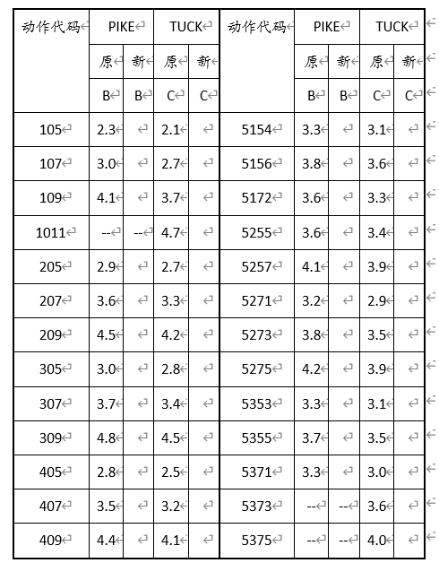

[动作代码说明]（1）第一位数表示起跳前运动员起跳前正面朝向以及翻腾方向，1、3表示面朝水池，2、4表示背向水池；1、2表示向外翻腾，3、4表示向内翻腾。（2）第三位数字表示翻腾圈数，例如407，表示背向水池，向内翻腾3周半。（3）B表示屈体，C表示抱膝。（4）如果第一位数字是5，表示有转体动作，此时，第二位数字意义同说明（1），第三位数字表示翻腾圈数，第四位数字表示转体圈数，例如5375，表示面向水池向内翻腾3周半，转体2周半。

#### 笔记

关键词:

非刚体动力学、随时间变化欧拉方程、kick动力学模型、生物力学、自适应遗传算法；

多刚体运动、角动量；

### 2018b 光传送网建模与价值评估

#### 题目描述

光传送网的规划与建设是运营商、设备商以及政府必须考虑的课题。光传送的基本规律是——在相同技术条件下传输的容量会随着传输距离增加而减小。网络规划者需要在有限资源的条件下，综合考虑传输距离，传输容量、网络拓扑等各种因素，以最大化网络的价值。本课题中，请你们站在上述角度，从底层物理出发为光传送链路建模，制定光传送网规划，探索光传送网有关规律。

本课题的内容包括：

1)   对光传送链路进行简单建模 

2)   制定光传送网的规划，并探讨网络的价值

3）改进调制格式

#### 笔记

关键词：

光传链路建模、光传输网规划、搜索树、穷举法、MATLAB、Lingo

光传链路建模、光传输网规划、星座图、极大似然准则、“破圈法”、贪心算法、动态规划

MQAM调制解调模型、SNR容限、最小生成树、Dijkstra、控制变量

光纤通信、信噪比、误码率、最小生成树、深度优先搜索

星座图、调制、正态分布、模拟退火、网络价值、路径规划

光传输网规划、二维高斯分布、最大生成树？、Floyd算法、模拟退火、QAM调制

遗传算法、TSP、优化问题、Djikstra

### 2018c 对恐怖袭击事件记录数据的量化分析

#### 题目描述

任务 1 依据危害性对恐怖袭击事件分级

但恐怖袭击事件的危害性不仅取决于人员伤亡和经济损失这两个方面，还与发生的时机、地域、针对的对象等等诸多因素有关，因而采用上述分级方法难以形成统一标准。请你们依据附件 1 以及其它有关信息，结合现代信息处理技术，借助数学建模方法建立基于数据分析的量化分级模型，将附件 1 给出的事件按危害程度从高到低分为一至五级

任务 2 依据事件特征发现恐怖袭击事件制造者

附件 1 中有多起恐怖袭击事件尚未确定作案者。如果将可能是同一个恐怖组织或个人在不同时间、不同地点多次作案的若干案件串联起来统一组织侦査，有助于提高破案效率，有利于尽早发现新生或者隐藏的恐怖分子。请你们针对在2015、2016 年度发生的、尚未有组织或个人宣称负责的恐怖袭击事件，运用数学建模方法寻找上述可能性，即将可能是同一个恐怖组织或个人在不同时间、不同地点多次作案的若干案件归为一类

任务 3 对未来反恐态势的分析

对未来反恐态势的分析评估有助于提高反恐斗争的针对性和效率。请你们依据附件 1 并结合因特网上的有关信息，建立适当的数学模型，研究近三年来恐怖袭击事件发生的主要原因、时空特性、蔓延特性、级别分布等规律，进而分析研判下一年全球或某些重点地区的反恐态势，用图/表给出你们的研究结果，提出你们对反恐斗争的见解和建议。

#### 笔记

关键词：

主客观集成赋权、OPTICS 聚类、XGBoost 集成学习、Lorenz 曲线、帕累托分析法、lightgbm-Multi logistic、ARMA 模型

DEA（数据包络分析）；DBSCAN 聚类分析；灰度关联度分析；危害等级 

信息完备性；量化评估；危害相对值；半监督学习SVM；类平均聚类法；RBF 时间序列模型；离群点检测 

因子分析、CRITIC赋权、DBCLASD聚类、Pearson相关系数、IPSO-SVM

量化分析；遗传模拟退火算法；FCM聚类模型、支持向量机；灰色预测 GM(1,1)模型；贝叶斯网络；  

量化分级、Fuzzy-C均值（FCM）聚类、层次分析-因子分析、

改进 k-means 主成分分析 逻辑回归 灰色预测 机器学习

### 2018d  基于卫星高度计海面高度异常资料获取潮汐调和常数方法及应用

#### 题目描述

#### 笔记

关键字：

T/P 卫星高度计 潮汐调和常数 j,v 模型 最小二乘法 多项式拟合 

卫星高度计；海面高度异常；潮汐调和常数；最小二乘法；调和分析

调和分析、潮汐调和常数、卫星高度计、车贝雪夫多项式拟合

调和分析；多项式拟合；内潮提取；克里金插值；同潮图；

数据插值、最近点跟踪法、高阶多项式轨迹插值法、最近点匹配比较法、数据清洗

潮汐调和常数；调和分析；多项式拟合；正压潮和内潮；同潮图

### 2018e 多无人机对组网雷达的协同干扰

#### 题目描述

组网雷达系统具有较强的抗干扰能力，利用多无人机协同干扰，可以对其产生理想的干扰效果

#### 笔记

关键字：

多无人机协同 禁忌搜索算法 路径规划 雷达干扰 

组网雷达系统, 协同干扰, 同源检验, 蚁群算法, 遗传算法 

协同干扰 虚假航迹 非线性规划模型 搜索算法

组网雷达 优化模型 枚举法 竞标算法 

电子对抗 协同干扰 立体几何 运筹优化 

### 2018f 机场新增卫星厅对中转旅客影响的研究

#### 题目描述

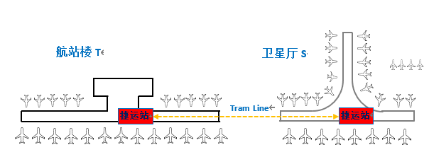

#### 笔记

关键字：

登机口分配，多目标多约束，航班分配失败率、最短流程时间、总体紧张度、被使用登机口比率，生物地理学算法 

登机口指派 0-1 整数规划 禁忌搜索算法 CPLEX 

组合优化 遗传算法 模拟退火 区域离散化 

航班-登机口分配，中转旅客换乘，启发式搜索，贪婪算法，遗传算法，parato 解集 

航班-登机口分配；组合优化；多目标优化邻域搜索算法；分阶段优化

01规划、区间调度算法、贪婪算法、MILP、模拟退火、python+cplex

## 2016

### 2016A 多无人机协同任务规划

#### 题目描述

#### 笔记

关键字：

多无人机协同 任务规划 两元素优化 贪心算法 无人机调度; 

模糊聚类分析 遗传算法 多目标路径选择 竞标算法 目标分配; 

分层规划 全局规划 多岛遗传算法 威胁程度 时间复杂度; 

无人机 协同作战 任务规划 2-opt算法 粒子群算法;

### 2016B 具有遗传性疾病和性状的遗传位点分析

#### 题目描述

#### 笔记

关键字：

遗传统计学 全基因组关联性分析(GWAS) 位点(SNPs) 卡方检测 多元线性回归 典型相关分析; 

位点(SNPs) 卡方检测 逻辑回归 典型关联分析(CCA); 

位点识别 全基因组关联分析 IV值 决策树 聚类分析; 

遗传统计学 全基因组关联性分析(GWAS) 位点(SNPs); 

遗传统计学 全基因组关联性分析 位点 卡方检测;

### 2016C 基于无线通信基站的室内三维定位问题

#### 题目描述

#### 笔记

关键字：

精确定位 非视距传播 非线性规划模型 连接度数; 

预估-校正-自适应 TOA定位模型 路径损耗模型 极大似然估计; 

移动终端三维定位 视距传播 非视距传播 TOA 最小二乘法 误差估计;

终端定位 最小二乘法 运动轨迹 定位精度; 

定位 NLOS 参数估计 最小二乘法 运动估计; 

CHAN算法 最小二乘法 NLOS 

 

### 2016D 军事行动避空侦察的时机和路径选择

#### 题目描述

#### 笔记

关键字：

军用卫星 运行轨迹 侦察范围 过顶预测 行军最优路径 避空侦察; 

避空侦察 星下点轨迹 最小误差法 应对策略; 

坐标变换 运行轨迹 Dijkstra算法 启发式搜索算法; 

单站短弧定轨 卫星轨道运动学 模拟退火算法 离散 侦察时序图 侦察盲区; 

基于时间的预测模型 卫星运行轨道极坐标模型 星下点轨迹 过顶时间求解模型 机动路径优化模型 覆盖模型; 

卫星运动 预测 全局优化 Dijkstra算法

 

### 2016E 粮食最低收购价问题研究

#### 题目描述

#### 笔记

关键字：

Spearman主成分回归 统计控制评价 价格形成 线性规划;

 Spearman 偏最小二乘法 混合线性模型 供需及价格联动模型 线性规划; 

SEM模型 验证性因子分析 路径分析 模糊可拓物元 蛛网模型 鲁棒优化 ARCH类模型 多元回归分析;

 粮食 多目标优化 遗传算法 动态优化 组合预测; 

主成分分析 多元线性回归 柯布-道格拉斯函数

 

## 2015

### 2015a 水面舰艇编队防空和信息化战争评估模型

#### 题目描述

我海军由1艘导弹驱逐舰和4艘导弹护卫舰组成水面舰艇编队在我南海某开阔海域巡逻，其中导弹驱逐舰为指挥舰，重要性最大。某一时刻t我指挥舰位置位于北纬15度41分7秒，东经112度42分10秒，编队航向200度（以正北为0度，顺时针方向），航速16节（即每小时16海里）。编队各舰上防空导弹型号相同，数量充足，水平最小射程为10千米，最大射程为80千米，高度影响不必考虑（因敌方导弹超低空来袭），平均速度2.4马赫（即音速340米/秒的2.4倍）。编队仅依靠自身雷达对空中目标进行探测，但有数据链，所以编队中任意一艘舰发现目标，其余舰都可以共享信息，并由指挥舰统一指挥各舰进行防御。

以我指挥舰为原点的20度至220度扇面内，等可能的有导弹来袭。来袭导弹的飞行速度0.9马赫，射程230千米，航程近似为直线，一般在离目标30千米时来袭导弹启动末制导雷达，其探测距离为30千米，搜索扇面为30度（即来袭导弹飞行方向向左和向右各15度的扇面内，若指挥舰在扇形内，则认为来袭导弹自动捕捉的目标就是指挥舰），且具有“二次捕捉”能力（即第一个目标丢失后可继续向前飞行，假设来袭导弹接近舰艇时受到电子干扰丢失目标的概率为85%，并搜索和攻击下一个目标，“二次捕捉”的范围是从第一个目标估计位置算起，向前飞行10千米，若仍然没有找到目标，则自动坠海）。每批来袭导弹的数量小于等于4枚（即由同一架或在一起的一批飞机几乎同时发射，攻击目标和导弹航向都相同的导弹称为一批）。

由于来袭导弹一般采用超低空飞行和地球曲率的原因，各舰发现来袭导弹的随机变量都服从均匀分布，均匀分布的范围是导弹与该舰之间距离在20-30千米。可以根据发现来袭导弹时的航向航速推算其不同时刻的位置，故不考虑雷达发现目标后可能的目标“丢失”。编队发现来袭导弹时由指挥舰统一指挥编队内任一舰发射防空导弹进行拦截，进行拦截的准备时间（含发射）均为7秒，拦截的路径为最快相遇。各舰在一次拦截任务中，不能接受对另一批来袭导弹的拦截任务，只有在本次拦截任务完成后，才可以执行下一个拦截任务。指挥舰对拦截任务的分配原则是，对每批来袭导弹只使用一艘舰进行拦截，且无论该次拦截成功与否，不对该批来袭导弹进行第二次拦截。不考虑每次拦截使用的防空导弹数量。

请通过建立数学模型，解决以下几个问题：                                                                                                                                                                                  

一，在未发现敌方目标时，设计编队最佳队形（各护卫舰相对指挥舰的方位和距离），应对所有可能的突发事件，保护好指挥舰，使其尽可能免遭敌导弹攻击。

二，当不考虑使用电子干扰和近程火炮（包括密集阵火炮）等拦截手段，仅使用防空导弹拦截来袭导弹，上述编队防御敌来袭导弹对我指挥舰攻击时的抗饱和攻击能力如何（当指挥舰遭遇多批次导弹几乎同时攻击时，在最危险的方向上，编队能够拦截来袭导弹的最大批数。）？

三，如果编队得到空中预警机的信息支援，对距离我指挥舰200千米内的所有来袭导弹都可以准确预警（即通报来袭导弹的位置与速度矢量），编队仍然保持上面设计的队形，仅使用防空导弹拦截敌来袭导弹对我指挥舰攻击时的抗饱和攻击能力（定义同上）提高多少？

四，预警机发现前方有12批可疑的空中目标，从t时刻起，雷达测得的目标位置信息在附件1的表格中（说明：表中作战时间为time_t格式，即从1970年1月1日0时起到某一时刻的秒数；目标位置经纬度的单位为弧度；目标高度的单位为米），各目标雷达反射面积见表1。用于判断空中目标的意图的知识和规则的样本见表2。请分析识别空中各目标可能的意图。（相关的背景知识介绍参见附件A）

五，如果我方的预警机和水面舰艇编队的雷达和通信系统遭到敌方强烈的电子干扰，无法发现目标，也无法传递信息，这时，后果将是极其严重的，我编队防空导弹的拦截效能几乎降低到零。由此引起人们的深思，信息化条件下作战对传统的作战评估模型和作战结果已经产生重要的甚至某种程度上是决定性的影响！在海湾战争（相关资料参见附件B）的“沙漠风暴”行动开始前，一些军事专家用传统的战争理论和战争评估模型进行预测，包括用兰彻斯特战争模型预测战争进程，结果却大相径庭，战争的实际结果让他们大跌“眼镜”。那么信息化战争的结果应该用什么样的模型来分析或预测呢？这是一个极具挑战性，又十分有意义的课题。请尝试建立宏观的战略级信息化战争评估模型，从一般意义上反映信息化战争的规律和特点，利用模型分析研究信息系统、指挥对抗、信息优势、信息系统稳定性，以及其它信息化条件下作战致胜因素的相互关系和影响（信息化战争相关概念参见附件C）。并通过信息化战争的经典案例，例如著名的海湾战争，对模型加以验证。

#### 笔记

关键字：

水面舰艇编队，Multi-Agent 系统，模糊识别模型，模特卡罗，战争评估模型 , 兰彻斯特方程

支持向量机；多目标规划；B 样条；云模型； 证据推理 

几何法建模、聚类分析、层次分析、兰彻斯特战争模型、信息化战争、

编队最佳队形 抗饱和攻击能力 经典分析判别法 机器学习分类法 、兰彻斯特方程模型 仿真法 综合信息化指数

最佳编队  抗饱和攻击能力  聚类分析  随机微分方程组  

最佳队形 抗饱和攻击 非线性规划 主成分分析 支持向量机 信息化战争评估模型

舰船编队阵型；抗饱和攻击能力；神经网络分类；兰彻斯特模型；战争进程评估 

### 2015b 数据的多流行结构分析

#### 题目描述

数据的多流形结构分析

我们已经进入了一个信息爆炸的时代，海量的数据不断产生，迫切需要对这些大数据进行有效的分析，以至数据的分析和处理方法成为了诸多问题成功解决的关键，涌现出了大量的数据分析方法。几何结构分析是进行数据处理的重要基础,已经被广泛应用在人脸识别、手写体数字识别、图像分类、等模式识别和数据分类问题，以及图象分割、运动分割等计算机视觉问题（人脸识别、图像分类、运动分割等实例见下文）中。更一般地，对于高维数据的相关性分析、聚类分析等基本问题，结构分析也格外重要。

文献[1]指出一个人在不同光照下的人脸图像可以被一个低维子空间近似，由此产生大量的数据降维方法被用来挖掘数据集的低维线性子空间结构，这类方法假设数据集采样于一个线性的欧氏空间。但是，在实际问题中很多数据具备更加复杂的结构。例如，文献[2]中指出，运动分割（motion segmentation）中的特征点数据具有多个混合子空间的结构，判断哪些特征点属于同一子空间是这个问题能否有效解决的关键。

针对单一子空间结构假设的后续讨论主要是两个方面，首先是从线性到非线性的扩展，主要的代表性工作包括流形（流形是局部具有欧氏空间性质的空间，欧氏空间就是流形最简单的实例）学习等。流形学习于2000年在著名杂志Science上被首次提出，之后逐渐成为了研究热点。基于数据均匀采样于一个高维[欧氏空间](http://baike.haosou.com/doc/5880390.html)中的低维流形的假设，流形学习试图学习出高维数据样本空间中嵌入的低维子流形，并求出相应的嵌入映射。流形学习的出现，很好地解决了具有非线性结构的样本集的特征提取问题。然而流形学习方法通常计算复杂度较大，对噪声和算法参数都比较敏感，并且存在所谓的样本溢出问题，例如，当增加新的样本点时，不能快速地提取新特征。

其次是流形或子空间从一个到多个的扩展，即假设数据集采样于多个欧氏空间的混合。子空间聚类（又称为子空间分割，假设数据分布于若干个低维子空间的并）是将数据按某种方式分类到其所属的子空间的过程。通过子空间聚类，可以将来自同一子空间中的数据归为一类，由同类数据又可以提取对应子空间的相关性质。根据综述[2]，子空间聚类的求解方法有代数方法、迭代方法、统计学方法和基于谱聚类的方法。其中基于谱聚类的方法在近几年较为流行，这类方法首先定义一个关于样本点相互关系的图，然后利用Normalized Cut[3]等谱聚类方法（其输入是一个反应样本关系的相似度矩阵，矩阵的第i行j列的数值越大说明第i个样本和第j个样本的关系越密切，如果能将同类样本的相似度构造的较大，不同类的较小，这类方法一般都能得到正确的分类结果）得到分割结果。代表性的基于谱聚类的子空间分割方法包括低秩表示[4]和稀疏表示[5]等，下面对这两种方法的做个简单介绍。

**稀疏子空间聚类：**

稀疏子空间聚类方法，是对子空间表示系数进行稀疏约束的一类子空间聚类方法。子空间聚类的最终结果是将同一子空间的数据归为一类。在子空间相互独立的情况下，属于某一子空间的数据只由这个子空间的基的线性组合生成，而在其他子空间中的表示系数为零。这样高维数据的表示系数就具有稀疏的特性。同一子空间中的数据，因为都仅在这一子空间中有非零的表示系数，表现为相同的稀疏特性，通过对表示系数稀疏约束的求解，突出了数据表示系数的这种稀疏特性，进而为数据的正确聚类提供支持。

**低秩子空间聚类**

通过对子空间表示系数矩阵的研究，有些学者在求解子空间表示系数矩阵时，引入核范数(一个矩阵的核范数是指矩阵的所有奇异值的加和)约束，希望通过系数矩阵的低秩要求得到更好的数据的子空间表示。文章[4]给出了低秩表示模型的闭解且理论上保证了当子空间独立且数据采样充分的情况时，低秩表示可以得到块对角的解。这个结论基本保证了低秩表示方法在解决独立子空间分割问题的有效性。

有些实际问题的数据并不符合混合子空间结构的假设，例如图3（a）中一个圆台的点云，圆台的顶，底和侧面分别采样于不同流形。所以假设数据的结构为混合多流形更具有一般性。由于混合流形不全是子空间的情况，数据往往具有更复杂的结构，分析这种数据具有更大的挑战性。基于谱聚类的方法仍然是处理该类问题的流行方法如文献[6]。虽然这类数据本身无法使用相互表示的方式，但是数据的特征可相互线性表示且表示系数具有稀疏性或低秩性的特点。由此一些学者通过提取数据的特征将低秩表示模型扩展用于处理图像分割[7]、图像的显著性检测[8]等问题。

本几何结构分析问题中假设数据分布在多个维数不等的流形上，其特殊情况是数据分布在多个线性子空间上。请按照文献中的方法或以文献中的方法为基础创新新的方法完成以下问题, 创新部分一定要讲清思路，要具有一般性（例如不仅适应低维数据也适应高维数据）。回答方式：第1题，第3题的b与c请制作一个表格输出样本的类别标签，每行20个，其余题目请将分类结果画出：

1.当子空间独立时，子空间聚类问题相对容易。附件一中1.mat中有一组高维数据（.mat所存矩阵的每列为一个数据点，以下各题均如此），它采样于两个独立的子空间。请将该组数据分成两类。

2.请处理附件二中四个低维空间中的子空间聚类问题和多流形聚类问题，如图1所示。图1(a)为两条交点不在原点且互相垂直的两条直线，请将其分为两类；图1(b)为一个平面和两条直线，这是一个不满足独立子空间的关系的例子，请将其分为三类。图1(c)为两条不相交的二次曲线，请将其分为两类。图1(d) 为两条相交的螺旋线，请将其分为两类。

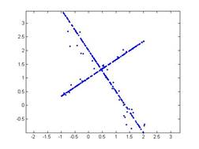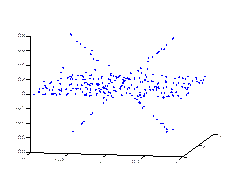

(a)                 (b)

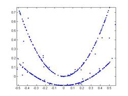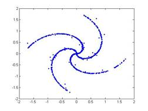

(c)                 (d)

图1

\3. 请解决以下三个实际应用中的子空间聚类问题，数据见附件三

（a）受实际条件的制约，在工业测量中往往需要非接触测量的方式，视觉重建是一类重要的非接触测量方法。特征提取是视觉重建的一个关键环节，如图2（a）所示，其中十字便是特征提取环节中处理得到的，十字上的点的位置信息已经提取出来，为了确定十字的中心位置，一个可行的方法是先将十字中的点按照 “横”和“竖”分两类。请使用适当的方法将图2（a）中十字上的点分成两类。

（b）运动分割是将视频中有着不同运动的物体分开，是动态场景的理解和重构中是不可缺少的一步。基于特征点轨迹的方法是重要的一类运动分割方法，该方法首先利用标准的追踪方法提取视频中不同运动物体的特征点轨迹，之后把场景中不同运动对应的不同特征点轨迹分割出来。已经有文献指出同一运动的特征点轨迹在同一个线性流形上。图2（b）显示了视频中的一帧，有三个不同运动的特征点轨迹被提取出来保存在了3b.mat文件中，请使用适当方法将这些特征点轨迹分成三类。

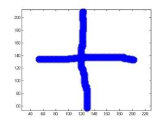

(a)                 (b)

图2

（c）3c.mat中的数据为两个人在不同光照下的人脸图像共20幅（X变量的每一列为拉成向量的一幅人脸图像），请将这20幅图像分成两类。

\4. 请作答如下两个实际应用中的多流形聚类问题

图3(a)分别显示了圆台的点云，请将点按照其所在的面分开(即圆台按照圆台的顶、底、侧面分成三类)。

图3(b)是机器工件外部边缘轮廓的图像，请将轮廓线中不同的直线和圆弧分类，类数自定。

#### 笔记

关键字：

谱多流形聚类   稀疏流形聚类与嵌入   稀疏子空间聚类  谱曲率聚类       谱聚类 

高维，局部空间，子空间，谱多流形聚类，分部谱聚类

谱聚类，稀疏，核映射，局部切线 

稀疏子空间聚类；交替方向法；拉普拉斯特征映射；谱多流形聚类

流形学习; LRR; SMMC; SSC; LRRTrack; 一维映射模型; PCA;

稀疏子空间；谱聚类；多流形聚类；降维模型 

谱聚类；流形；稀疏子空间；降维；运动分割；正则项 

谱聚类；流形；稀疏子空间；降维；运动分割；正则项 

稀疏子空间聚类，逐步多流形谱聚类，直线探测，增加数据维度 

流形学习、稀疏子空间聚类(SSC)、多流形聚类方法(SMMC)、PID策略、二维广义主成分分析(2DIMPCA)、局部与结构一致性方法(LSC) 

### 2015c 移动通信中的无线信道“指纹”特征建模 

#### 题目描述

**一、背景介绍**

移动通信产业一直以惊人的速度迅猛发展，已成为带动全球经济发展的主要高科技产业之一，并对人类生活及社会发展产生了巨大的影响。在移动通信中，发送端和接收端之间通过电磁波来传输信号，我们可以想象两者之间有一些看不见的电磁通路，并把这些电磁通路称为无线信道。无线信道与周围的环境密切相关，不同环境下的无线信道具有一些差异化的特征。如何发现并提取这些特征并将其应用于优化无线网络，是当前的一个研究热点。类比人类指纹，我们将上述无线信道的差异化的特征称为无线信道“指纹”。无线信道“指纹”特征建模，就是在先验模型和测试数据的基础上，提取不同场景或不同区域内无线信道的差异化的特征，进而分析归纳出“指纹”的“数学模型”，并给出清晰准确的“数学描述”。

在典型的无线信道中，电磁波的传输不是单一路径的，而是由许多因散射（包括反射和衍射）而形成的路径所构成的。由于电磁波沿各条路径的传播距离不同，因此相同发射信号经由各条路径到达接收端的时间各不相同，即多径的时延之间有差异。此外，各条路径对相同发射信号造成的影响各不相同，即多径的系数之间有差异。如左下图所示：

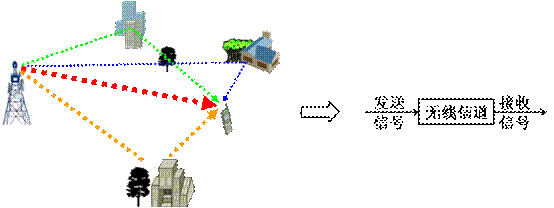

工程上，考虑到多径系数及多径时延的影响，在保证精度的前提下，可以用“离散线性系统”为无线信道建模。需要注意的是，该模型中的信号及多径系数均为复数。理想信道测量可以理解为获取该系统的单位序列响应，即获取单位脉冲“”经无线信道传输后被接收到的信号，如右上图所示。上述理想信道测量的结果用公式表述如下:

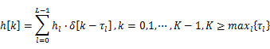

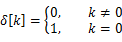

其中，“”为离散信号的样点标识，这里假设共有“”个样点；“”是当前时刻的路径**总**数；“”为当前时刻第条路径上的信道系数，通常是复数；“”为当前时刻第条路径的时延，且已折算成样点数，即延迟了“”个样点。显然，复信号“”给出了当前时刻的完整信道。需要强调的是，上述各个参数，包括“”、“”和“”都会随着时间而变化，即各个参数具有时变性。相应地，“”的功率在信号波长[1]“”的量级上会出现时而加强时而减弱的快速变化，称之为多径衰落或小尺度衰落。同时，快速变化的功率，其平均值也会出现缓慢的变化，这主要是由于周围环境或气象条件的改变而引起的，称之为阴影衰落或大尺度衰落。两种衰落特征如下图所示：

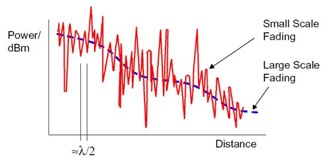

上述理想信道测量的结果“”是无法直接获取的。因为在真实无线通信系统中，为了改善信号的传输质量，通常需要在系统的发射端和接收端，各增加一个滤波器。所有滤波器在真实信道测量中的影响，可以等效地用函数“”来表示。此时信道测量的结果为：

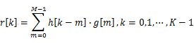

其中，“”为滤波器的长度，即“”的样点数。考虑到信道的时变性以及实测中引入了噪声，不同时刻的真实信道测量结果及其对应的无线信道分别为：

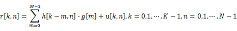

其中，“”表示测试的样本标识，对应测试时刻，这里假设共有“”个样本；“”表示“”时刻第条路径上的信道系数，通常是复数；“”表示“”时刻第条路径延迟的样点数；“”表示“”时刻第“”个测试样本上引入的复高斯白噪声；“”表示“”时刻单位脉冲依次经发送滤波器、信道和接收滤波器后的实际接收信号，是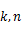的二元函数。显然，我们可以从“”中获取完整的时变信道“”。为了便于理解，下图给出了不同时刻下无线信道的示意图，同时也给出了样本标识“”和样点标识“”的相互关系。容易发现，不同时刻下多径的条数、时延以及系数值都有可能发生变化。直观上，变化的参数都含有一些场景化的特征，即上述不同参数的变化可能存在一定的规律。

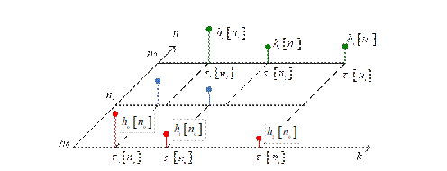

基于上述或更多的参数及特征，一个场景或一定区域内的无线信道可能存在一定的“指纹”。利用所定义的“指纹”，进行场景的分析以及无线网络的优化，具有重要意义。我们希望利用真实信道测量结果分析建立信道的“指纹”模型。该模型可以是一个参数或多个参数（例如多径数目、多径时延、时延扩展、Doppler扩展、是否有直达径等[2][3][4]）的组合或函数，也可以是某种图形化的描述；可能是时间域的，也可能是频率域的[5]；可能是确定性的，也可能是统计意义上的。关键是所建立“指纹”模型能够从统计意义上有效区分出某个场景或区域。

**二、待研究的问题：**

本研究旨在挖掘、提炼和聚合实测信道数据中的各种特征，进而用数学的语言描述“指纹”，并验证其在不同场景或不同地理位置下的适用性，具体包括：

问题1：“数据包1”提供了三种场景的真实信道测量结果。基于三种已知场景的测量结果，参考背景中的知识介绍，采用数学建模特别是特征提取的方法，对所提供的样本加以分析，给出无线信道“指纹”的模型。在此基础上，给出简洁而明确的“评价指标”，用于分析验证所建模“指纹”合理有效。所谓有效是指，该模型应能从数学上对已知的三种场景进行合理区分。要求详细说明建模的思路、使用的方法以及得出结论的过程。另外，所提取的特征或所建立的模型最好有一定的物理意义。最后，提供获取“指纹”的程序代码，要求代码可运行，但代码形式不限。

问题2：“数据包2”提供了与“问1”中某些场景相对应的二个真实信道测量结果。基于“问题1”中所提供的三个场景，以及所建立的“指纹”模型和“评价指标”，采用数学的方法，识别出此处提供的二个样本分别属于哪个场景。需要保证“场景识别”的结果正确，且对识别的结果进行合理的分析。请明确给出“场景识别”的结果，并详细描述分析的过程。

问题3：“数据包3”提供了一条连续路段的真实信道测量结果。该结果对应于以3km/h的速度步行近150m的测试距离。该路段可能包含不同的场景或环境，对应不同的“指纹”特征。基于上述测量结果，先自行分段，采用“问题1”中的建模方法，给出分段的“指纹”分析。在分段分析的基础上，对所提取的“指纹”进行合理分类。通过对比不同段的分析结果，最终决定该路段可以依“指纹”划分为多少个区域。理论上，“区域划分”越细，后续做“区域识别”的精确程度越高，但过细的“区域划分”会在“指纹”特征中引入更多的错误，导致误判概率增大。要求详细说明“区域划分”的思路及过程，并对划分结果进行合理的分析。

问题4：“数据包4”提供了二个真实信道测量结果。基于“问题3”中的“区域划分”和“问题1”中的“评价指标”，首先判断此处提供的二个样本是否采集自“问题3”中所提供的路段。对于已判断出的采自上述路段的样本，请识别其对应于“问题3”中的哪一块区域。需要保证“样本判断”的结果正确，以及“区域识别”的误判距离尽可能小，同时对所识别的结果进行合理的分析。要求详细说明样本判别的思路和方法，以及得出结论的过程。

#### 笔记

关键字：

优化理论、统计学方法、稀疏模型、最优拟合

信道“指纹” 主元数据  特征向量  多普勒频谱  延时扩展  

无线信道；指纹提取；统计学方法、K 均值聚类

无线信道建模、指纹特征提取、场景识别、时间序列分段、分段序列、kalman滤波

多径信道指纹、MPOC、FFT、K-means、主多径 

道特征，Tamura 纹理，变换域，多径估计 

### 2015d面向节能的单/多列车优化决策问题

#### 题目描述

轨道交通系统的能耗是指列车牵引、通风空调、电梯、照明、给排水、弱电等设备产生的能耗。根据统计数据，列车牵引能耗占轨道交通系统总能耗40%以上。在低碳环保、节能减排日益受到关注的情况下，针对减少列车牵引能耗的列车运行优化控制近年来成为轨道交通领域的重要研究方向。

**1.**    **列车运行过程**

列车在站间运行时会根据线路条件、自身列车特性、前方线路状况计算出一个限制速度。列车运行过程中不允许超过此限制速度。限制速度会周期性更新。在限制速度的约束下列车通常包含四种运行工况：牵引、巡航、惰行和制动。

l 牵引阶段：列车加速，发动机处于耗能状态。

l 巡航阶段：列车匀速，列车所受合力为0，列车是需要牵引还是需要制动取决于列车当时受到的总阻力。

l 惰行阶段：列车既不牵引也不制动，列车运行状态取决于受到的列车总阻力，发动机不耗能。

l 制动阶段：列车减速，发动机不耗能。如果列车采用再生制动技术，此时可以将动能转换为电能反馈回供电系统供其他用电设备使用，例如其他正在牵引的列车或者本列车的空调等（本列车空调的耗能较小，通常忽略不计）。

如果车站间距离较短，列车一般采用“牵引-惰行-制动”的策略运行。如果站间距离较长，列车通常会采用牵引到接近限制速度后，交替使用惰行、巡航、牵引三种工况，直至接近下一车站采用制动进站停车。

​                               

**图** **1** **列车站间运行曲线**

 

**2.**    **列车动力学模型**

列车在运行过程中，实际受力状态非常复杂。采用单质点模型是一种常见的简化方法。单质点模型将列车视为单质点，列车运动符合牛顿运动学定律。其受力可分为四类：重力G在轨道垂直方向上的分力与受到轨道的托力抵消，列车牵引力F，列车制动力B和列车运行总阻力W。

 

**图****2** **单质点列车受力分析示意图**

（1）列车牵引力 

列车牵引力  是由动力传动装置产生的、与列车运行方向相同、驱动列车运行并可由司机根据需要调节的外力。牵引力  在不同速度下存在不同的最大值  ，具体数据参见附件。列车实际输出牵引力（kN）基于以下公式进行计算。

 

其中，  为实际输出的牵引加速度与最大加速的的百分比，  为牵引力最大值（kN）。

 

**图3** **列车牵引特征曲线示意图**

（2）列车运行总阻力 

列车总阻力是指列车与外界相互作用引起与列车运行方向相反、一般是阻碍列车运行的、不能被司机控制的外力。按其形成原因可分为基本阻力和附加阻力。

1）基本阻力

列车的基本阻力是列车在空旷地段沿平、直轨道运行时所受到的阻力。该阻力是由于机械摩擦，空气摩擦等因素作用而产生的固有阻力。具体可分为以下五部分：1、车轴轴承间摩擦阻力；2、轮轨间滚动摩擦阻力；3、轮轨间滑动摩擦阻力；4、冲击阻力；5气动阻力。因此，基本阻力与许多因素有关，它主要取决于机车、车辆结构和技术状态、轴重、以及列车运行速度等，同时又受线路情况、气候条件影响。由于这些因素极为复杂，而且相互影响，实际应用中很难用理论公式进行准确计算，通常采用以下经验公式进行计算：

 

其中  为单位基本阻力（N/kN），A、B、C为阻力多项式系数，通常取经验值，  为列车速度（km/h）。

2）附加阻力

列车由于在附加条件下（通过坡道、曲线、隧道）运行所增加的阻力叫做附加阻力。附加阻力主要考虑坡道附加阻力和曲线附加阻力。

 

列车的坡道附加阻力是列车上下坡时重力在列车运行方向上的一个分力。通常采用如下公式计算

 

其中  为单位坡道阻力系数（N/kN），  为线路坡度（‰）。  为正表示上坡，  为负表示下坡。

列车的曲线阻力主要源自取决于轨道线路的曲率半径，列车在曲线上运行时，轮轨间纵向和横向的滑动摩擦力增加，转向架等各部分摩擦力也有所增加。通常采用如下公式计算：

 

其中  为单位曲线阻力系数（N/kN），  为曲率半径（m）；  为综合反映影响曲线阻力许多因素的经验常数，我国轨道交通一般取600。

有时为了计算方便，当坡道附加阻力，曲线附加阻力同时出现时，根据阻力值相等的原则，把列车通过曲线时所产生的附加阻力折算为坡道阻力，加上线路实际坡度即为加算坡度。

​          综上，列车运行总阻力可按照如下公式计算：

 

其中，  为线路阻力（N），  为单位基本阻力系数（N/kN），  为单位附加阻力系数（N/kN），M为列车质量（kg），  为重力加速度常数。

（3）列车制动力 

制动力  是由制动装置引起的、与列车运行方向相反的、司机可根据需要控制其大小的外力。制动力  存在与制动时列车速度有关的最大值，   ，当然制动力也可以小于  。具体数据参见附件。列车实际输出制动力（kN）基于以下公式进行计算

 

其中，  为实际输出的制动加速度与最大加速的的百分比，  为制动力最大值（kN）。

 

**3.**    **运行时间与运行能耗的关系**

当列车在站间运行时，存在着多条速度距离曲线供选择。不同速度距离曲线对应不同的站间运行时间和不同的能耗。列车按照图4所示4条曲线可以走完相同的距离，但运行时间和能耗并不相同。此外，即便站间运行时间相同时，也存在多条速度距离曲线可供列车选择。

 

**图4** **列车站间运行速度距离曲线**

一般认为，列车站间运行时间和能耗存在近似图5中的反比关系，比较准确的定量关系应根据前面的公式计算。注意，增加相同的运行时间不一定会减少等量的能耗。列车站间运行时间与能耗变化的趋势影响能耗的减少。

 

**图5** **站间运行时间与能耗关系。**

 

**图6** **再生能量利用示意图**

 

 

4 **再生能量利用原理**

随着制动技术的进步，目前城市轨道交通普遍采用再生制动。再生制动时，牵引电动机转变为发电机工况，将列车运行的动能转换为电能，发电机产生的制动力使列车减速，此时列车向接触网反馈电能，此部分能量即为再生制动能。如图6所示，列车i+1在制动时会产生能量  ，如果相邻列车i处于加速状态，其可以利用  ，从而减少从变电站获得的能量，达到节能的目的。如果列车i+1制动时，其所处供电区段内没有其他列车加速，其产生的再生能量除用于本列车空调、照明等设备外，通常被吸收电阻转化为热能消耗掉。

假设：

产生的再生能量

其中  是制动过程中列车机械能的变化量，  是制动过程中为克服基本阻力和附加阻力所做功。

被利用了的再生能量可按照以下假设的公式计算

 

其中  是列车i+1制动的时间与列车i加速时间的重叠时间，  是列车i+1的制动时间。即制动时所产生的再生能量与制动时间成正比。

 

请研究以下问题：

一、单列车节能运行优化控制问题

（1）    请建立计算速度距离曲线的数学模型，计算寻找一条列车从A6站出发到达A7站的最节能运行的速度距离曲线，其中两车站间的运行时间为110秒，列车参数和线路参数详见文件“列车参数.xlsx”和“线路参数.xlsx”。

（2）    请建立新的计算速度距离曲线的数学模型，计算寻找一条列车从A6站出发到达A8站的最节能运行的速度距离曲线，其中要求列车在A7车站停站45秒，A6站和A8站间总运行时间规定为220秒（不包括停站时间），列车参数和线路参数详见文件“列车参数.xlsx”和“线路参数.xlsx”。

注：请将本问（1）和（2）得到的曲线数据按每秒钟一行填写到文件“数据格式.xlsx”中红色表头那几列，并将该文件和论文一并提交。（请只填写和修改数据，一定不要修改文件“数据格式.xlsx”的格式。其中计算公里标（m）是到起点的距离，计算距离（m）是到刚通过的一站的距离）

二、多列车节能运行优化控制问题

（1）    当100列列车以间隔H={h1,…,h99}从A1站出发，追踪运行，依次经过A2，A3，……到达A14站，中间在各个车站停站最少Dmin秒，最多Dmax秒。间隔H各分量的变化范围是Hmin秒至Hmax秒。请建立优化模型并寻找使所有列车运行总能耗最低的间隔H。要求第一列列车发车时间和最后一列列车的发车时间之间间隔为T0=63900秒，且从A1站到A14站的总运行时间不变，均为2086s（包括停站时间）。假设所有列车处于同一供电区段，各个车站间线路参数详见文件“列车参数.xlsx”和“线路参数.xlsx”。

补充说明：列车追踪运行时，为保证安全，跟踪列车（后车）速度不能超过限制速度  ，以免后车无法及时制动停车，发生追尾事故。其计算方式可简化如下：

 

其中  是列车当前位置的线路限速（km/h），  是当前时刻前后车之间的距离(m)，  是列车制动的最大减速度(m/s2) 

（2）    接上问，如果高峰时间（早高峰7200秒至12600秒，晚高峰43200至50400秒）发车间隔不大于2.5分钟且不小于2分钟，其余时间发车间隔不小于5分钟，每天240列。请重新为它们制定运行图和相应的速度距离曲线。

三、列车延误后运行优化控制问题

接上问，若列车i在车站Aj延误  （10秒）发车，请建立控制模型，找出在确保安全的前提下，首先使所有后续列车尽快恢复正点运行，其次恢复期间耗能最少的列车运行曲线。

假设  为随机变量，普通延误（0<  <10s）概率为20%，严重延误（  >10s）概率为10%（超过120s，接近下一班，不考虑调整），无延误（  0）概率为70%。若允许列车在各站到、发时间与原时间相比提前不超过10秒，根据上述统计数据，如何对第二问的控制方案进行调整？

#### 笔记

关键字：

单/多列车，再生制动，非线性内点法，遗传算法，“分步”优化方法 

列车节能，多岛遗传，NSGA-Ⅱ多目标优化，Pareto 前端解

列车节能运行，多约束条件，定值搜索优化算法，联合迭代算法，制动能量再生 

列车运行优化 节能 再生能量利用 站点延误

优化控制 节能 速度距离曲线 匀变速运动 牵引 制动 

运动学模型、动力学模型、

列车节能优化；模拟优化；布谷鸟优化算法；动态搜索；多目标优化

动力学原理；多目标优化；迭代禁忌搜索；遗传算法；蒙特卡洛模拟仿真 

单列车的节能优化最优控制模型  单列车的速度—路程计算模型  多列车的发车间隔优化分析模型  列车延误恢复优化控制模型 

列车规划，延误调整，整数规划，模拟退火，哈密尔顿函数 

序列二次规划（SQP） 最优控制理论 遗传算法 迭代算法 非线性优化  

### 2015e 数控加工刀具运动的优化控制

#### 题目描述

数控加工技术正朝着高速高效高精度方向发展，高速加工要求机床各运动轴都能够在极短的时间内达到高速运行状态并实现高速准停，研究开发数控加工刀具运动满足高速、高精度要求的、有效柔性加减速控制方法，已成为现代高性能数控系统研究的重点。

基于计算机的数控系统的工作原理是：首先通过计算机组成的数控编程系统对读入的零件信息进行存储和译码等处理后通过输入装置将它们传输给加工控制系统，然后由数控系统对输入的指令进行信息处理和轨迹插补计算出数控机床各坐标轴方向上刀具运动的控制信息（这个环节就是题目要求完成的任务），进而通过机床驱动以及机床运动将刀具在各坐标轴方向上的运动合成为刀具实际加工轨迹和速度控制，加工出所需的工件。

上述环节的难点在于数控机床对加工刀具在三个坐标轴方向的运动（本题不考虑更复杂的五轴控制等，）实行的是分别控制，但显然它们之间必须相互协调；加工刀具行走的路线一定是一系列首尾相接的直线段，因此加工刀具的运动轨迹一般与工件几何形状之间肯定存在误差；每一机床都有对应的分辨率，上述任一直线段对应的坐标增量记为，则的长度一定都是分辨率的整数倍，故加工刀具的运动方向受限制，并影响到加工刀具在三个坐标轴方向上的速度、加速度；要求机床运动平稳，速度光滑、加速度连续等。

加工刀具运动的优化控制则是在数控机床所提供的精度、速度、加速度等限制条件下，寻求对机床刀具在各坐标轴方向上的运动进行合理控制，进而优化其加工效率。类似方程式赛车，有经验的车手可根据赛道特点及赛车的性能（如速度、加速度等）对赛车的行进路线及过程进行优化。而对于一般曲线加工，加工控制算法就是在满足误差要求的条件下，通过插补的方法，找出若干小直线段组成加工刀具的运动轨迹，同时计算出刀具对应的运动速度、加速度。

目前，数控加工对单个坐标运动的控制方法有多种，其中较有代表性的是基于S型曲线的加减速控制方法。其特点是将加减速过程分为7个阶段（每一段对应的加加速度为常量）：加加速段、匀加速段、减加速段、匀速段、加减速段、匀减速段、减减速段，从而渐变地控制各段的加速度使机床运动速度按S型曲线形式平滑变化，以保证速度光顺，加速度连续，在一定程度上增强机床运行的平稳性。S型加减速控制曲线如图1所示。

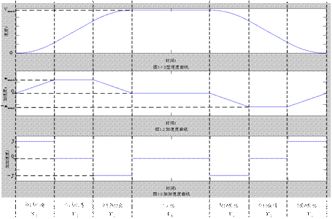

图1 S型加减速控制曲线的速度、加速度、加加速度随时间变化规律

在基于S型曲线的运动过程中，对于速度和加速度都有一定的限制性要求，速度不大于机床最大速度，加速度不大于机床最大加速度，加加速度为常量。图１中各个阶段的速度、加速度、加加速度随时间的变化规律如附录所示。

在目前采用的S型速度控制曲线中，加速度每次都是从0增加，最后又降为0，而在实际运动过程中电机启动时允许有一个瞬时启动加速度a0，即认为加速度可以从0瞬间提高到瞬时加速度a0，或瞬间从a0下降到0，速度也有类似功能，这样整个加速过程及速度的变化规律有一些改变。

 假设不考虑刀具尺寸大小及刀具磨损，加工刀具抽象为一点。希望同学们在深入研究数控加工优化控制的基础上，完成以下工作：

1、设加工型线为折线，在指定加工误差（指在加工型线的法线方向上加工型线与刀具实际轨迹的差值的最大值）的条件下，建立实时加工优化控制算法，当相邻两折线段夹角为90°和135°时，讨论通过折线交点时对应各坐标运动速度的变化；

2、设加工型线是由直线段和圆弧段（相切或不相切）组成的连续曲线，在指定加工误差的条件下，不考虑瞬时启动加速度及瞬时启动速度，建立实时加工优化控制算法，讨论圆弧半径的变化对算法效率的影响；并应用所建立的模型对下面的加工路径示例进行检验；

3、在第2问基础上，考虑瞬时启动加速度及瞬时启动速度，建立相对应的实时加工优化控制算法；并应用所建立的模型对下面的加工路径示例进行检验；

4、结合前3问，分析S型曲线的加减速控制方法的优缺点，在满足精度和速度要求的条件下，建立能提高机床运行平稳性的优化控制运动模型（如刀具在各坐标轴方向上的运动满足加加速度连续变化等）。

#### 笔记

关键字：

数控；运动模型；优化控制；插补； S 形曲线；光滑转接 

S 型曲线加减速 数控加工 前瞻算法 插补模型 路径优化 改进型三角函数算法 

数控刀具；改进后的 S 型曲线加减速控制算法；加工型线；五次位移曲线 

数控加工 优化控制 S 型加减速曲线 傅里叶级数 sigmoid 函数优化;夹角过渡模型;圆弧插补;S曲线加减速算法;三次多项式加减速控制 

数控车床；矢量转接；正弦函数；S 型曲线 

### 2015f 旅游路线规划问题旅游路线规划问题

#### 题目描述

旅游活动正在成为全球经济发展的重要动力之一，它加速国际资金流转和信息、技术管理的传播，创造高效率消费行为模式、需求和价值等。随着我国国民经济的快速发展，人们生活水平得到很大提升，越来越多的人积极参与有益于身心健康的旅游活动。

  附件1提供了国家旅游局公布的201个5A级景区名单，一位自驾游爱好者拟按此景区名单制定旅游计划。该旅游爱好者每年有不超过30天的外出旅游时间，每年外出旅游的次数不超过4次，每次旅游的时间不超过15天；基于个人旅游偏好确定了在每个5A级景区最少的游览时间（见附件1）。基于安全考虑，行车时间限定于每天7:00至19:00之间，每天开车时间不超过8小时；在每天的行程安排上，若安排全天游览则开车时间控制在3小时内，安排半天景点游览，开车时间控制在5小时内；在高速公路上的行车平均速度为90公里/小时，在普通公路上的行车平均速度为40公里/小时。该旅游爱好者计划在每一个省会城市至少停留24小时，以安排专门时间去游览城市特色建筑和体验当地风土人情（不安排景区浏览）。景区开放时间统一为8:00至18:00。请考虑下面问题：

   （一）在行车线路的设计上采用高速优先的策略，即先通过高速公路到达与景区邻近的城市，再自驾到景区。附件1给出了各景区到相邻城市的道路和行车时间参考信息，附件2给出了国家高速公路相关信息，附件3给出了若干省会城市之间高速公路路网相关信息。请设计合适的方法，建立数学模型，以该旅游爱好者的常住地在西安市为例，规划设计旅游线路，试确定游遍201个5A级景区至少需要几年？给出每一次旅游的具体行程（每一天的出发地、行车时间、行车里程、游览景区；若有必要，其他更详细表达请另列附件）。

  （二）随着各种旅游服务业的发展，出行方式还可以考虑乘坐高铁或飞机到达与景区相邻的省会城市，而后采用租车的方式自驾到景区游览（租车费用300元/天，油费和高速过路费另计，租车和还车需在同一城市）。此种出行方式可以节省一些路途时间用于景区游览或休闲娱乐，但这种出行方式也会给旅游者带来一些不便，有时费用也会增加。该旅游爱好者根据个人旅游偏好确定在每一个景区最长逗留时间不超过附件1给出的最少时间的2倍。附件4给出了若干城市之间的高铁票价和相关信息（约定：选择高铁出行要求当天乘坐高铁的时间不超过6个小时，乘坐高铁或飞机的当天至多安排半天的景区游览）；附件5给出了若干省会城市之间的机票全价价格信息（含机场建设费）。该旅游爱好者一家3人同行，综合考虑前述全程自驾、先乘坐高铁或飞机到达省会城市后再租车自驾到景区等出行方式（住宿费简化为省会城市和旅游景区200元/人•天，地级市150元/人•天，县城100元/人•天；高速公路的油耗加过路费平均为1.00元/公里， 普通公路上油耗平均为0.60元/公里；附件1中给出了各景区所在地的信息，若景区位于某城市市区或近郊，则这类景区的市内交通费用已计入住宿费中，不再另计），建立数学模型设计一个十年游遍所有201个5A景区、费用最优、旅游体验最好的旅游线路，给出每一次旅游的具体线路（含每次具体出行方式；每一天的出发地、费用、路途时间、游览景区、每个景区的游览时间）。

  （三）能否在第二问所建立的模型基础上加以推广，可以为全国的自驾游爱好者规划设计类似的旅游线路，进而给出常住地在北京市的自驾游爱好者的十年旅游计划；根据上述三问的结果给旅游爱好者和旅游有关部门提出建议。

  （四）自2007年3月7日至2015年7月13日，全国旅游景区质量等级评定委员会分29批共批准了201家景区为国家5A级旅游景区。附件6是从国家旅游局官网上收集的国家5A级旅游景区评定的相关信息，附件7给出了国家旅游局官网上收集的国家4A级景区名单，请更为合理地规划该旅游爱好者的十年旅游计划。

#### 笔记

关键字：

自驾游路线规划；复杂交通网；多目标规划；模糊综合评价；系统动力学 

多旅行商；改良圈；蚁群算法；基本粒子群优化算法

旅行商问题(TSP) 多车辆路径问题(MVRP) 遗传算法(GA) 旅游计划

TSP 规划、模拟退火算法、层次分析法、Hamilton 圈、最短旅游路径、5A 景点 

最短路径；旅游路线规划；局部优化；多目标线性规划 

旅游路线；粒化；最优化；遗传算法；层次 

全局区域嵌套优化模型 01整数规划法 模拟退火算法 聚类分析 秩和比综合评价法  信息量权重法 

旅行路线规划 多目标优化 蚁群算法 遗传算法 TSP 问题 0-1 变量 

三层旅游计划；二级装箱问题；分层规划；满意度最小建模；满意度补偿策略 

旅游路线规划；网络优化；TSP 模型；模拟退火算法；分层序列法 

## 2013

### 2013A 变循环发动机部件法模型的求解与优化:

#### 题目描述

#### 笔记

关键字：

发动机部件法建模 拟牛顿方法 优选初值 遗传算法 神经网络 代理模型; 变

循环发动机 部件法建模 牛顿-拉弗森法 遗传算法 BP神经网络; 

变循环发动机 部件法建模 平衡方程 变域变步长搜索; 

二阶线性插值 Jacobi矩阵 多初值Newton迭代法 遗传算法 变循环; 

变循环发动机 非线性方程组模型 多目标规划模型 线性插值 牛顿-拉弗森法 线性标量化方法 灵敏度分析;

 逐维线性插值 逐步搜索法 二分法 阻尼牛顿法 非线性规划有数优化算法 变循环发动机 喷涡模式 双涵道 单涵道; 

多维非线性隐式方程组 牛顿-拉弗森法 遗传算法 加权适应度函数 多目标优化; 

变循环航空发动机 部件级建模 遗传算法 双涵模式 单涵模式

 

### 2013B 功率放大器非线性特征及预失真建模:

#### 题目描述

#### 笔记

关键字：

功率放大器 非线性 预失真 记忆多项式模型 间接学习结构; 

最小二乘法 Tikhonov正则化 Fourier变换; 

功率放大器 预失真 正交基多项式 最小二乘法 间接学习结构; 

幂级数模型 记忆多项式模型 补偿迭代法 LS算法 最大熵法; 

功率放大器 非线性特性 预失真补偿 功率谱密度; 

Saleh模型 复系数多项式模型 无记忆多项式模型 记忆多项式模型 RLS; 

多项式模型 自适应模型 最小二乘法 优化模型 线性特征; 

非线性特征 预失真 改进LMS 记忆多项式 功率谱密度; 

正交多项式模型 系统逆辨识 最小二乘法 最小均方算法 自适应损失真系统; 

 

### 2013C 微蜂窝环境中无线接收信号的特性分析:

#### 题目描述

#### 笔记

关键字：

微蜂窝 射线跟踪模型 一阶矩 二阶矩 反射 绕射 绕射系数 多波干涉现象 相关性; 

射线跟踪方法 虚拟源 多叉树 多波干涉; 

有效反射面 镜像法 绕射路径分解法 随机模拟 Rayleigh分布; 

微蜂窝 射线跟踪 测试射线法 虚拟源射线跟踪法 多波干涉 宽带多波干涉; 

射线跟踪 UTD理论 几何光线理论 希尔伯特变换 广度优先搜索; 

量化追踪 镜像源树 等效基带分析 宽带多径干涉 统计分析模型;

 

### 2013D 空气中PM2.5问题的研究:

#### 题目描述

#### 笔记

关键字：

相关性分析模型 灰色关联度模型 高斯烟羽模型 柯西分布函数; 

PM2.5 空气质量指数 污染等级 相关分析 多元线性回归 连续点源 扩散模型 专项治理; 

相关分析 逐步回归 非线性规划 有限元; 

回归分析 偏相关 时空分布 AHP 结构网络; 

因子分析 污染物扩散 衰减系数 专项治理; 

相关分析 回归分析 二维插值 最小二乘法 残差估计 偏微分方程模型 多目标线性规划模型; 

主成分分析 多元回归 改进高斯模型 小波神经网络 最优化; 

空气污染 PM2.5 相关分析 反应波扩散方程 高斯烟羽模型 优化模型; 

二维多箱模型 高斯扩散衰减模型 目标优化

 

### 2013E 中等收入定位与人口度量模型研究:

#### 题目描述

#### 笔记

关键字：

中等收入 洛伦兹曲线 收入空间法 人口空间法; 

中等收入 洛伦兹曲线 分配公平度;

 中等收入定位 洛伦兹曲线 基尼系数 贫富分化 收入分配; 

洛伦兹曲线 噪声概念 多项式模型 中等收入人口 收入空间法 人口空间法; 

洛伦兹曲线 两极分化指标 中等收入人口比重;

 

### 2013F 可持续的中国城乡居民养老保险体系的数学模型研究:

#### 题目描述

#### 笔记

关键字：

养老保险 可持续 学生化残差 相关分析 灰色关联度 多重共线性 主成分分析 多重线性回归 支持向量机 精算解析;

 收支模型 养老金缺口 合意替代率 可持续性 基金投资组合; 

养老金 收支模型 缺口 转轨成本 仿真模拟; 

养老保险体系 可持续 新农保 城职保 缺口 自适应 仿真; 

养老金收支模型 养老金缺口 系统仿真 可持续化 可调节变量

## 2012

### 2012a 基因识别问题及其算法实现

#### 题目描述

针对基因识别问题，提出了频谱与信噪比的快速算法，并研究了阈值确定方法，以此为基础设计了准确的快速基因识别算法，并用于判别基因突变等问题。

#### 笔记

关键字：

基因识别、快速算法、最优阈值、小波变换、可变滑动窗

频谱 3-周期性 阈值确定 编码区预测 基因突变识别

基因识别；频谱分析；噪声抑制；EPND；滤波；信噪比 

基因识别，功率谱，信噪比，Fourier变化、AR 模型，阈值，重采样 

基因识别 功率谱 信噪比 阈值 3-周期特性 联合识别

信噪比；3-周期性；阈值；基因识别；剪切位点；隐马尔可夫模型

### 2012b 基于卫星无源探测的空间飞行器主动段轨道估计与误差分析

#### 题目描述

#### 笔记

关键字：

数据拟合、运动模型、最小二乘法、

样条插值，运动方程参数模型，最小二乘法，LMF 法 

低通滤波、伴随同化、数据拟合、逐点交汇定位、最小二乘法

轨道估计，系统误差，四阶龙格库塔算法，滑窗四点交汇，基于级数理论的多项式模型，联合序贯多点 

坐标系转换，逐点交汇定位，轨道估计，遗传算法，残差估计，误差分析，搜索算法，模型验证

卫星 飞行器 轨道 系统误差 参数估计 

测向交叉定位  无源探测  微分方程数值解  轨道估计  误差分析

双星预警 单行预警 弹道估计 最小二乘估计  

几何定位算法 优化模型 最小二乘法 目标跟踪算法 Kalman 滤波 LMF算法

逐点交汇法，轨道估计，位置半径，循环降阶优化，三轴指向误差

### 2012c 有杆抽油系统的数学建模及诊断

#### 题目描述

目前，开采原油广泛使用的是**有杆抽油系统**（垂直井，如图1）。电机旋转运动转化为抽油杆上下往返周期运动，带动设置在杆下端的**泵**的两个阀的相继开闭，从而将地下上千米深处蕴藏的原油抽到地面上来。

钢制抽油杆由很多**节**连接而成，具有相同直径的归为同一**级**，级数从上到下按1,2…进行编号，可多达5级，从上端点到下端点可能长达上千米。描述抽油杆中任意一水平截面（为表述方便，下面把杆水平截面抽象称为“点”）处基本信息的通用方法是**示功图**：它是该点随时间*t*而变化的**荷载**（合力，向下为正）数据作为纵坐标，以该点垂直方向上随时间*t*而变化的位置相对于*t*=0时刻该点位置的**位移**数据作为横坐标构成的图形。函数关系表现为**位移****-****荷载**关于时间*t*的参数方程。一个**冲程**（冲程的说明见附录）中示功图是一条封闭的曲线。构成示功图的数据称为**示功数据**。

抽油杆上端点称为**悬点**，图4示意了悬点E的运动过程。在一个冲程期间，仪器以一系列固定的时间间隔测得悬点E处的一系列位移数据和荷载数据，据此建立悬点E的示功图称为**悬点示功图**。附件1、2中的位移-荷载数据是某油田某井采油工作时采集的悬点处原始示功数据。

“**泵”**是由柱塞、游动阀、固定阀、部分油管等几个部件构成的抽象概念（见图2），泵中柱塞处的示功图称为**泵功图**。因为受到诸多因素的影响，在同一时刻*t*，悬点处的受力（荷载）与柱塞的受力是不相同的；同样，在同一时刻*t*，悬点处的相对位移与柱塞的相对位移也不相同。因此悬点示功图与泵功图是不同的。图5给出了理论悬点示功图和理论泵功图。示功图包含了很多信息，其中就有**有效冲程**，泵的有效冲程是指泵中柱塞在一个运动周期内真正实现从出油口排油的那段冲程。工程上一般根据示功图形状与理论示功图进行对比来判断抽油机工作状态。

通过悬点示功图可以初步诊断该井的工作状况，如产量、气体影响、阀门漏液、沙堵等等。要精确诊断油井的工作状况，最好采用泵功图。然而，泵在地下深处，使用仪器测试其示功数据实现困难大、成本高。因此，通过数学建模，把悬点示功图转化为杆上任意点的示功图（统称为**地下示功图**）并最终确定泵功图，以准确诊断该井的工作状况，是一个很有价值的实际问题。

**请解决以下问题：**

**问题一：光杆悬点运动规律**

电机旋转运动通过四连杆机构转变为抽油杆的垂直运动。假设驴头外轮廓线为部分圆弧、电机匀速运动，悬点E下只挂光杆（光杆下不接其它杆，不抽油，通常用来调试设备）。请按附录4给出四连杆各段尺寸，利用附件1的参数，求出悬点E的一个冲程的运动规律：位移函数、速度函数、加速度函数。并与有荷载的附件1的悬点位移数据进行比较。

**问题二：泵功图计算**

1966年，Gibbs给出了悬点示功图转化为地下示功图的模型[3],[4]，由于受计算机速度的限制，直到近些年才得以被重新重视。请使用Gibbs模型，给出由悬点示功图转化为泵功图的详细计算过程，包括：原始数据的处理、边界条件、初始条件、求解算法；附件1是只有一级杆的某油井参数和悬点示功数据，附件2是有三级杆的另一油井参数和悬点示功数据，利用它们分别计算出这两口油井的泵功图数据；并分别绘制出两油井的悬点示功图和泵功图（每口井绘一张图，同一井的悬点示功图与泵功图绘在同一张图上，请标明坐标数据）。

**问题三：泵功图的应用**（下面2小问选作一问。鼓励全做）

1）建立2个不同的由泵功图估计油井产量的模型，其中至少一个要利用“有效冲程”；并利用附件1和附件2的数据分别估算两口油井一天（24小时）的产液量。（单位：吨，这里所指的液体是指从井里抽出来的混合液体）

2）如图5（C）形式的泵功图表示泵内有气体，导致泵没充满。请建立模型或算法，以由计算机自动判别某泵功图数据是否属于泵内有气体的情况。并对附件1、附件2对应的泵功图进行计算机诊断是否属于泵内充气这种情况。

**问题四：深入研究的问题**（下面2小问选作一问。鼓励全做）

1）请对Gibbs模型进行原理分析，发现它的不足。在合理的假设下，重新建立抽油系统模型或对现有模型进行改进；并给出由悬点示功图转化为泵功图的详细计算过程，包括：原始数据的处理、边界条件、初始条件、求解算法；利用附件1、附件2的数据重新进行计算；对计算结果与问题二的计算结果进行比较，分析你的模型的优缺点。

2）Gibbs模型在数学上可简化为 “波动方程”： 其中a为已知

常数，c称为阻尼系数，鉴于大多数的阻尼系数公式[1][2]是作了诸多假设后推出的，并不能完整地反应实际情况。如果能从方程本身和某些数据出发用数学方法估计参数c，贡献是很大的。对此，请你进行研究，详细给出计算c的理论推导过程并尽可能求出c。如果需要题目之外的数据，请用字母表示之并给出计算c的推导过程。

#### 笔记

关键字：

有杆抽油系统，Gibbs 模型，有效冲程法，面积法，灰色理论与网格法，非齐次波动方程模型 

有杆抽油，图解法，有效冲程，Gibbs，示功图，泵功图，能量守恒，摩擦功，尼系数

四连杆模型  Gibbs模型  泵功图  日产液量估算  阻尼系数 

有杆抽油系统 悬点示功图 泵功图 Gibbs 模型 有效冲程 灰色理论

Gibbs 模型 Fourier 级数逼近 功图量油 有限差分法 反解 

有杆抽油机 Gibbs 模型 泵功图 粘滞阻尼系数 

能量守恒 泵功图曲线曲率 微元体受力分析 有限差分方法 重力分布载荷 冲程临界特征点 

有杆抽油 Gibbs 波动方程 泵功图 有效冲程法 液量迭代法 自动诊断故障系统 有限差分法 迭代法 阻尼系数

### 2012d 基于卫星云图的风矢场（云导风）度量模型与算法探讨

#### 题目描述

卫星云图在掌握大气环流、中长期天气预报以及灾害性天气学的研究中有重要作用。它由地球同步卫星上的红外探测仪探测地球上空的温度数据再转换成灰度数据制作而成。附件中定标数据文件k_temp.txt给出了灰度数据与温度数据的转换关系，k_temp.txt内有1024个实型数，依次是图象灰度数据为0到1023所对应的K氏温度值，灰度值为 -1时对应的是地球以外的探测点。[注：地球是被探测温度的唯一来源，如果天空无云，探测到的温度可以看成是地球表面的温度；在有云层的地方，探测到的温度相对较低，且云层越高越厚温度就越低，探测到的温度可看成云层所在区域的温度]。红外探测仪扫描采样时，按步进角(南北方向)和行扫描角（东西方向）均为140微弧（1弧度＝1000000微弧）采样。在卫星与地球中心的连线和地球表面的交点（称为星下点）处的分辨率大约是5公里。本题提供的卫星探测数据文件都是2288×2288的灰度值矩阵，矩阵的每个元素都对应地球上或地球外的一个探测点（或称采样点）。同步卫星离地球中心的高度为42164000米, 星下点在东经86.5度, 北纬0度，星下点对应的矩阵元素位于矩阵的第1145行和第1145列相交处。

为解答本题，首先要确定灰度矩阵中每个元素对应的采样点在地球上的经纬度。地球可视为理想椭球，这个理想椭球可以由地球的一个经过南北极的椭圆截面绕南北极的连线旋转而得到，椭圆截面的长半轴（赤道半径）=6378136.5m, 短半轴（极半径）=6356751.8m；据此就可以将灰度矩阵中非负元素的行列号按上北下南、左西右东的**地图规则**换算成地球上经纬度坐标，此结果既可用于估算各探测点之间的距离，还可用于在云图上依据海岸线经纬度坐标标出海岸线以方便看图。

观测大气环流情况的一个方法是在卫星云图上标出风矢。风矢的大小和方向由云块移动的速度决定。风矢与风的速度有所不同，如某个台风中一些区域的风速可达每秒五、六十米，而台风（看作云块）中心的移动速度可能仅每小时十多公里。没有云或云块不稳定处的风矢规定为零风矢，这种用云块的移动所定义的风矢被称为云迹风。气象部门已经有一些方法根据变化的卫星云图计算云迹风，这类方法称为**云导风方法。**计算云迹风时通常将云块大小限定为16×16个像素，搜索范围限定为64×64个像素。

本题的主要目的是希望大家充分利用卫星图像数据及其特点建立尽可能准确地描述实际风矢场的度量模型和算法。

#### 笔记

关键字：

云导风；相关法；最大费用最大流；模糊模式识别 

云导风；坐标变换；最大交叉相关系数；信息熵；双线性插值

云导风， 模板匹配， 自适应，质量控制， 交叉相关系数

坐标变换，相关系数法，风矢计算,自适应窗口，灰度梯度

卫星视场；卫星云图；风矢；坐标变换；自适应 

云导风；相关匹配法；灰度梯度信息；等压面；

？小波变换，相位匹配，Haar 函数，卫星云图 

交叉相关系数 风矢预测 特征提取 全局匹配 

## 2010

### 2010A 基于神经网络的基因图谱信息提取方法的研究:

#### 题目描述

#### 笔记

关键字：

基因表达谱 GB指数 MIV BP神经网络 小波变换 贝叶斯; 

基因表达谱 信息基因 巴氏距离 FSSM 噪声 KFS模型; 

含噪 基因簇 独立成分分析 支持向量机 非光滑优化模型 临床 基因标签; 

肿瘤基因 特征提取 分类识别 小波去噪 信息融合; 

相关系数矩阵 最小生成树 复杂网络 社区结构; 

 

### 2010B 与封堵口有关的封堵物落水后运动过程的数学模型研究:

#### 题目描述

#### 笔记

关键字：

封堵物落水运动过程模型 二分法 参数识别 相似准则; 

微分方程模型 光折射原理 相对误差分析; 

封堵溃口 机理分析 普适性 压差阻力 误差分析 详细准则; 

动力学模型 阻力系数 空心率 小型实验 相似定律; 

重物落水后运动 微分方程 择优法 稳态误差; 

运动过程 最优化理论 噪声; 

 

### 2010C 神经元形态分类与识别的数学模型:

#### 题目描述

#### 笔记

关键字：

神经元 形态分类 决策树 神经网络 支持向量机 分形; 

神经元 几何形态 SVM决策树 SOM聚类分析; 

神经元分类 多酚类集成 差分特征选择 生长模型 边界距离; 

属性选择 贝叶斯分布 EM聚类 10折交叉验证; 

神经元 几何特征 SVM 主成分分析 k-means 隐式马尔科夫模型; 

神经元 空间构象 层次分析 几何相似性 Scilab; 

分级多层二叉树分类 综合特征判别法 多分类支持向量机 同特征参数搜索; 

形态分户 主成分分析 BP神经网络 生长模型

 

### 2010D 特殊工件磨削加工研究:

#### 题目描述

#### 笔记

关键字：

插补 包络 多项式插值 多级优化 磨损均匀; 

磨削加工 步进电机 控制脉冲 顺序遍历发 等窗滑差; 

磨削加工 常微分方程 坐标变换 样条插值 一般母线; 

磨削加工 回旋体 母线 误差分析; 

砂轮 最优化 点磨法 误差分析 磨损均匀; 

正运动学 逆运动学 磨削加工 步进电机 Delphi; 

加工方案 控制脉冲时刻表 脉冲分布 误差分析 坐标变化; 

## 2009

### 2009a 城镇登记失业率的研究与预测

#### 题型描述

#### 笔记

关键字：

失业率 预测 神经网络 层次分析法 相关度系数

格兰杰因果关系检验 主成分分析法 误差修正模型 ECM 灰色预测

主成分分析 聚类分析 预测模型 预期岗位裕量 投资回报指数

城镇就业人口；逐步回归；VAR 模型；模型仿真； 

灰色关联度  VAR模型 个体固定效应模型 制度分析 

路径分析 多变量自回归 有效就业投资 就业缺口 多目标规划 

就业；影响就业指标体系；灰色关联度；相关系数；神经网络预测 

城镇就业人数 协整 ECM 模型 脉冲响应 方差分解 VAR 模型 

就业人数 Granger 因果检验 人工神经网络 可加性分解模型 VEC 模型 最小二乘拟合 协整检验 

主成分分析法，BP 神经网络，失业率仿真预测 

主成分分析 多元逐步回归模型 BP 神经网络 Logistic 预测模型 

因子分析法；回归模型；波士顿矩阵；BP 神经网络 

### 2009b 枪弹头很急自动比对方法的研究

#### 题型描述

#### 笔记

关键字：

弹痕比对 最小二乘圆法 小波变换 神经网络 纹理特征 

弹痕比对、特征提取、特征融合

展平面，三坐标测量重定位，CCF，小波分析，绝对差分和

形状特征曲线  曲面匹配  多点预定位  相似度  有效性评价 

弹痕 自校准 一阶不变矩 相似度 自动比对 

枪弹头痕迹 自动比对 精确解析算法 

小波变换 灰度图像 弹头识别 

小波变换 相关系数分析 最小二乘法 阈值去噪 

### 2009c 多传感器融合和航迹预测

#### 题型描述

#### 笔记

关键字：

### 2009d 110警车配置及巡逻方案

#### 题型描述

#### 笔记

关键字：

计算几何   最短路算法  KMP 贪心算法  模糊数学

集合覆盖模型；启发式 SCHF 算法；结点优先；离散随机模型 

模拟退火算法  动态仿真  分形维数  平均巡逻强度  多目标规划 

k-means、Dijkstra、图论、01-规划模型

警车配置、巡逻方案、旅行商问题、模型优化、隐蔽性、分区域巡逻 

# 国赛试题及笔记

### 2020a 炉温曲线

#### 题型描述

在集成电路板等电子产品生产中，需要将安装有各种电子元件的印刷电路板放置在回焊炉中，通过加热，将电子元件自动焊接到电路板上。在这个生产过程中，让回焊炉的各部分保持工艺要求的温度，对产品质量至关重要。目前，这方面的许多工作是通过实验测试来进行控制和调整的。本题旨在通过机理模型来进行分析研究。

回焊炉内部设置若干个小温区，它们从功能上可分成4个大温区：预热区、恒温区、回流区、冷却区（如图1所示）。电路板两侧搭在传送带上匀速进入炉内进行加热焊接。

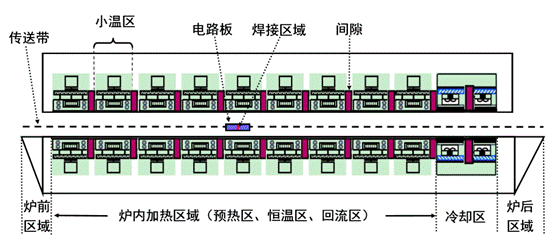

图1 回焊炉截面示意图

某回焊炉内有11个小温区及炉前区域和炉后区域（如图1），每个小温区长度为30.5 cm，相邻小温区之间有5 cm的间隙，炉前区域和炉后区域长度均为25 cm。

回焊炉启动后，炉内空气温度会在短时间内达到稳定，此后，回焊炉方可进行焊接工作。炉前区域、炉后区域以及小温区之间的间隙不做特殊的温度控制，其温度与相邻温区的温度有关，各温区边界附近的温度也可能受到相邻温区温度的影响。另外，生产车间的温度保持在25ºC。

在设定各温区的温度和传送带的过炉速度后，可以通过温度传感器测试某些位置上焊接区域中心的温度，称之为炉温曲线（即焊接区域中心温度曲线）。附件是某次实验中炉温曲线的数据，各温区设定的温度分别为175ºC（小温区1~5）、195ºC（小温区6）、235ºC（小温区7）、255ºC（小温区8~9）及25ºC（小温区10~11）；传送带的过炉速度为70 cm/min；焊接区域的厚度为0.15 mm。温度传感器在焊接区域中心的温度达到30ºC时开始工作，电路板进入回焊炉开始计时。

实际生产时可以通过调节各温区的设定温度和传送带的过炉速度来控制产品质量。在上述实验设定温度的基础上，各小温区设定温度可以进行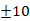ºC范围内的调整。调整时要求小温区1~5中的温度保持一致，小温区8~9中的温度保持一致，小温区10~11中的温度保持25ºC。传送带的过炉速度调节范围为65~100 cm/min。

在回焊炉电路板焊接生产中，炉温曲线应满足一定的要求，称为制程界限（见表1）。

 

表1  制程界限

| **界限名称**                      | **最低值**                                   | **最高值**                                   | **单位** |
| --------------------------------- | -------------------------------------------- | -------------------------------------------- | -------- |
| 温度上升斜率                      |  |  | ºC/s     |
| 温度下降斜率                      | 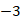 |  | ºC/s     |
| 温度上升过程中在150ºC~190ºC的时间 |  |  | s        |
| 温度大于217ºC的时间               |  | 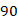 | s        |
| 峰值温度                          |  |  | ºC       |

 

请你们团队回答下列问题：

**问题****1** 请对焊接区域的温度变化规律建立数学模型。假设传送带过炉速度为78 cm/min，各温区温度的设定值分别为173ºC（小温区1~5）、198ºC（小温区6）、230ºC（小温区7）和257ºC（小温区8~9），请给出焊接区域中心的温度变化情况，列出小温区3、6、7中点及小温区8结束处焊接区域中心的温度，画出相应的炉温曲线，并将每隔0.5 s焊接区域中心的温度存放在提供的result.csv中。

**问题****2** 假设各温区温度的设定值分别为182ºC（小温区1~5）、203ºC（小温区6）、237ºC（小温区7）、254ºC（小温区8~9），请确定允许的最大传送带过炉速度。

**问题****3** 在焊接过程中，焊接区域中心的温度超过217ºC的时间不宜过长，峰值温度也不宜过高。理想的炉温曲线应使超过217ºC到峰值温度所覆盖的面积（图2中阴影部分）最小。请确定在此要求下的最优炉温曲线，以及各温区的设定温度和传送带的过炉速度，并给出相应的面积。

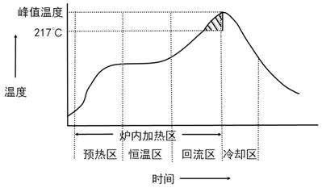

图2 炉温曲线示意图

问题4 在焊接过程中，除满足制程界限外，还希望以峰值温度为中心线的两侧超过217ºC的炉温曲线应尽量对称（参见图2）。请结合问题3，进一步给出最优炉温曲线，以及各温区设定的温度及传送带过炉速度，并给出相应的指标值。

#### 笔记

关键字：

### 2020b 穿越沙漠

#### 题目描述

考虑如下的小游戏：玩家凭借一张地图，利用初始资金购买一定数量的水和食物（包括食品和其他日常用品），从起点出发，在沙漠中行走。途中会遇到不同的天气，也可在矿山、村庄补充资金或资源，目标是在规定时间内到达终点，并保留尽可能多的资金。

游戏的基本规则如下：

（1）以天为基本时间单位，游戏的开始时间为第0天，玩家位于起点。玩家必须在截止日期或之前到达终点，到达终点后该玩家的游戏结束。

（2）穿越沙漠需水和食物两种资源，它们的最小计量单位均为箱。每天玩家拥有的水和食物质量之和不能超过负重上限。若未到达终点而水或食物已耗尽，视为游戏失败。

（3）每天的天气为“晴朗”、“高温”、“沙暴”三种状况之一，沙漠中所有区域的天气相同。

（4）每天玩家可从地图中的某个区域到达与之相邻的另一个区域，也可在原地停留。沙暴日必须在原地停留。

（5）玩家在原地停留一天消耗的资源数量称为基础消耗量，行走一天消耗的资源数量为基础消耗量的                                倍。

（6）玩家第0天可在起点处用初始资金以基准价格购买水和食物。玩家可在起点停留或回到起点，但不能多次在起点购买资源。玩家到达终点后可退回剩余的水和食物，每箱退回价格为基准价格的一半。

（7）玩家在矿山停留时，可通过挖矿获得资金，挖矿一天获得的资金量称为基础收益。如果挖矿，消耗的资源数量为基础消耗量的  倍；如果不挖矿，消耗的资源数量为基础消耗量。到达矿山当天不能挖矿。沙暴日也可挖矿。

（8）玩家经过或在村庄停留时可用剩余的初始资金或挖矿获得的资金随时购买水和食物，每箱价格为基准价格的2倍。

请根据游戏的不同设定，建立数学模型，解决以下问题。

\1. 假设只有一名玩家，在整个游戏时段内每天天气状况事先全部已知，试给出一般情况下玩家的最优策略。求解附件中的“第一关”和“第二关”，并将相应结果分别填入Result.xlsx。

\2. 假设只有一名玩家，玩家仅知道当天的天气状况，可据此决定当天的行动方案，试给出一般情况下玩家的最佳策略，并对附件中的“第三关”和“第四关”进行具体讨论。

\3. 现有  名玩家，他们有相同的初始资金，且同时从起点出发。若某天其中的任意  名玩家均从区域A行走到区域B(  )，则他们中的任一位消耗的资源数量均为基础消耗量的  倍；若某天其中的任意  名玩家在同一矿山挖矿，则他们中的任一位消耗的资源数量均为基础消耗量的  倍，且每名玩家一天可通过挖矿获得的资金是基础收益的  ；若某天其中的任意  名玩家在同一村庄购买资源，每箱价格均为基准价格的  倍。其他情况下消耗资源数量与资源价格与单人游戏相同。

（1）假设在整个游戏时段内每天天气状况事先全部已知，每名玩家的行动方案需在第  天确定且此后不能更改。试给出一般情况下玩家应采取的策略，并对附件中的“第五关”进行具体讨论。

（2）假设所有玩家仅知道当天的天气状况，从第  天起，每名玩家在当天行动结束后均知道其余玩家当天的行动方案和剩余的资源数量，随后确定各自第二天的行动方案。试给出一般情况下玩家应采取的策略，并对附件中的“第六关”进行具体讨论。

#### 笔记

关键字：

### 2020c 中小微企业的信贷决策

#### 题型描述

在实际中，由于中小微企业规模相对较小，也缺少抵押资产，因此银行通常是依据信贷政策、企业的交易票据信息和上下游企业的影响力，向实力强、供求关系稳定的企业提供贷款，并可以对信誉高、信贷风险小的企业给予利率优惠。银行首先根据中小微企业的实力、信誉对其信贷风险做出评估，然后依据信贷风险等因素来确定是否放贷及贷款额度、利率和期限等信贷策略。

某银行对确定要放贷企业的贷款额度为                                万元；年利率为4%~15%；贷款期限为1年。附件1~3分别给出了123家有信贷记录企业的相关数据、302家无信贷记录企业的相关数据和贷款利率与客户流失率关系的2019年统计数据。该银行请你们团队根据实际和附件中的数据信息，通过建立数学模型研究对中小微企业的信贷策略，主要解决下列问题：

(1) 对附件1中123家企业的信贷风险进行量化分析，给出该银行在年度信贷总额固定时对这些企业的信贷策略。

(2) 在问题1的基础上，对附件2中302家企业的信贷风险进行量化分析，并给出该银行在年度信贷总额为1亿元时对这些企业的信贷策略。

(3) 企业的生产经营和经济效益可能会受到一些突发因素影响，而且突发因素往往对不同行业、不同类别的企业会有不同的影响。综合考虑附件2中各企业的信贷风险和可能的突发因素（例如：新冠病毒疫情）对各企业的影响，给出该银行在年度信贷总额为1亿元时的信贷调整策略。

#### 笔记

关键字：

### 2020

#### 题型描述

#### 笔记

关键字：

### 2020

#### 题型描述

#### 笔记

关键字：

### 2020

#### 题型描述

#### 笔记

关键字：

### 2020

#### 题型描述

#### 笔记

关键字：

