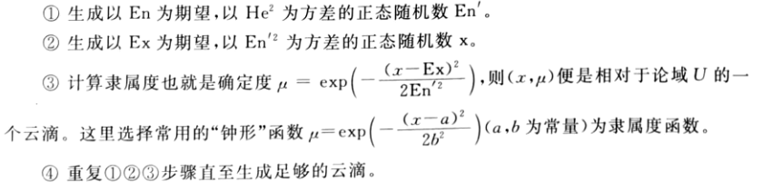

# 比赛组织


### 团队计划

| 项目              |    德国时间     | 注意事项                         |
| ----------------- | :-------------: | -------------------------------- |
| 选题              |   09-17-2:00    |                                  |
| 文献检索          |      09-17      | 主要是为了确定模型选择；         |
|                   |                 | 包括中英文论文、书籍、论坛回答； |
|                   |                 | 需要知网？Sci-Hub                |
|                   |                 | 使用 citavi                      |
| 建模+编程快速实现 |   09-17~09-18   |                                  |
| 出图出表+论文     |   09-18~09-19   |                                  |
| 检查+提交md       | 截止09-20-11:00 |                                  |


#### 赛前准备

押宝（按优先级排序）

1. 规划问题（运筹学的线性、非线性、整型规划；图算法；现代优化算法）
2. 动力学建模
3. 一般统计学问题（PCA，k-means, 因子分析，方差分析等）

准备：

1. 相关的算法是什么？（比如规划问题包括运筹学的线性、非线性、整型规划；图算法；现代优化算法）
2. 看往年试题，如何将实际问题转化为规划问题，并使用相关的算法
3. 使用什么工具可以实现该算法（比如某个MATLAB的包）


### 论文写作

#### 论文结构

* 摘要：总体介绍+每个子问题的使用模型或方法+关键字
* 目录：
* 一、问题重述
* 二、模型假设及符号说明
* 三、问题一建模与求解
* 四、问题二建模与求解
* 五、问题三建模与求解
* 六、总结（模型评价）
* 参考文献
* 附录（代码）


#### 格式规范

l 每个参赛队可以从A、B、C、D、E、F题中任选一题完成论文。

l 论文题目和摘要写在论文摘要上，摘要页的下一页开始论文正文。

l 论文从摘要页开始编写页码，页码必须位于每页页脚中部，用阿拉伯数字从“1 ”开始连续编号。

l 论文不能有页眉，论文中不能有任何可能显示答题人身份的标志。

l 论文题目用三号黑体字、一级标题用四号黑体字，并居中。论文中其他汉字一律采用小四号宋体字，行距用单倍行距。计算机结果和源程序需在规定时间内上传竞赛系统以备检查。

l 请大家注意：摘要应该是一份简明扼要的详细摘要（包括关键词），请认真书写（注意篇幅一般不超过两页，且无需译成英文）。全国评阅时对摘要和论文都会审阅。

l 引用别人的成果或其他公开的资料(包括网上甚至在“博客”上查到的资料) 必须按照规定的参考文献的表述方式在正文引用处和参考文献中明确列出。正文引用处用方括号标示参考文献的编号，如[1][3]等；引用书籍还必须指出页码。参考文献按正文中的引用次序列出，其中书籍的表述方式为：

[编号] 作者，书名，出版地：出版社，起止页码，出版年。

参考文献中期刊杂志论文的表述方式为：

[编号] 作者，论文名，杂志名，卷期号：起止页码，出版年。

参考文献中网上资源的表述方式为：

[编号] 作者，资源标题，网址，访问时间（年月日）。

 

### 开赛公告

**一、时间节点**

报名时间： 2020年6月1日8:00——9月10日17:00
审核时间： 2020年6月1日8:00——9月13日17:00
交费时间： 2020年7月1日8:00——9月14日17:00

1.加密题目开始下载时间：2020年9月16日8:00, 截止时间：2020年9月20日17:00

2.题目解密密码公布时间：2020年9月17日8:00, 截止时间：2020年9月20日17:00

**3.竞赛开始时间：2020年9月17日8:00, 截止时间：2020年9月21日12:00**

4.上传竞赛论文MD5码开始时间：2020年9月20日12:00,截止时间：2020年9月21日12:00

5.竞赛论文上传开始时间：2020年9月21日14:00，截止时间：2020年9月22日24:00

6.附件上传开始时间：2020年9月23日8:00，截止时间：9月24日24:00

7.查看论文开始时间：2020年9月23日8:00，截止时间：9月25日12:00

**二、队伍编号的生成**

队伍编号是参赛队提交论文的重要信息码之一，将在2020年9月16日8:00公布，届时队长可登陆中国研究生创新实践系列大赛管理平台，进入个人中心-我的赛事-下载试题/上传论文功能中查看队伍编号，请各参赛队队长查看后牢记队伍编号。

**三、竞赛试题下载及论文上传流程**

竞赛试题统一通过中国研究生创新实践系列大赛管理平台发布，队长登陆账号，进入个人中心-我的赛事功能进行竞赛试题的下载及论文上传。

具体流程详见《“华为杯”第十七届中国研究生数学建模竞赛下载试题及上传论文操作手册》（附件1），请务必仔细阅读。

**四、论文要求**

**（一）格式要求**

今年论文首先全部采用计算机网评，后集中评审，请务必依照《“华为杯”第十七届中国研究生数学建模竞赛论文格式规范》(附件2)、使用《“华为杯”第十七届中国研究生数学建模竞赛论文模板》（附件3）进行论文编写，具体要求如下：

1. 上传竞赛网站的电子版论文（包括摘要）必须为pdf格式，不得压缩。

2. 论文命名格式：参赛试题编号+队伍编号，如*20000010001.pdf，其中*为参赛试题编号，用A、B、C、D、E、F表示。

3. 论文必须按附件3模板进行编写，并确保提交的论文的首页为封皮（**不可删除**，包含团队相关信息，但5个图标**不能替换**），第二页起为摘要页和正文页。除首页外其他页面中不允许出现单位、参赛人员姓名、队伍编号等信息，否则视为违规，论文无效。

4.使用“统一摘要页”（附件3）。为了保证评审质量，提请参赛研究生注意摘要一定要将论文创新点、主要想法、做法、结果、分析结论表达清楚，如果一页纸不够，摘要可以写成两页。

**（二）上交要求**

因参赛队伍较多，为缓解网络压力，本届大赛采用提交论文的MD5识别码—提交论文pdf文件—提交附件（可选）三步分时段依次进行，具体要求为：

1. 竞赛提交论文的MD5识别码的开始时间是2020年9月20日12:00,截止时间是9月21日12:00，请参赛研究生队在此时段之间提交识别码（**注意：MD5识别码与提交论文对应，一旦提交MD5识别码，相应论文禁止修改，否则论文将无法成功上传**）。

2. 竞赛提交论文的开始时间为9月21日14:00，截止时间是9月22日24:00，请参赛研究生队在此期间内于竞赛系统中提交论文，**只须上传pdf文档，无须上传其他附件**。论文上传成功后请务必点击【提交】按钮，提交成功后后台方能收到论文。

3. 赛题中有明确要求上传附件或赛题虽然无明确要求，但本队认为上传附件有利于评审专家理解本队研究成果的，并在论文中声明上传了附件，参赛队伍可在2020年9月23日8:00—9月24日24：00期间在系统上上传程序、计算结果等论文附件的压缩包，压缩包命名格式为：参赛试题编号+队伍编号，如*20000010001.rar，其中*为参赛试题编号，用A、B、C、D、E、F表示。附件大小不得超过50M。此环节不是必须项。

**五、其他注意事项**

1. 此次竞赛不收取纸质论文，全部线上提交，请参赛队伍尽量提前提交，避开最终截止时间点的高峰，如因错过截止时间导致的问题，组委会一概不予处理。

2. 参赛队若在“提交论文的MD5识别码”环节遇到网络问题等不可控因素无法在截止时间（21日12:00）前上传，请将系统上传失败或错误的截图、论文MD5码、与MD5码相对应的论文pdf文件、队伍编号等相关信息发送至承办方邮箱 ：gmcm2020@163.com，邮件发送截止时间为21日13:00，超过截止时间邮件无效。

   若确实由于网络原因提交失败，系统后台会有相关记录，组委会将比对系统后台记录与邮件内容，决定是否给予该队伍参赛资格。

3. 竞赛期间仅开放数学建模网（[www.shumo.com](http://www.shumo.com/)）论坛上提问（QQ群在竞赛期间禁言），如果对赛题的文字理解方面有问题，可以在论坛上提问，专家委员会将组织命题人员在网上解答，不应回答的，恕不回答。请研究生在提问前事先查看已经回答的问题以免重复。

4. 违规处理：参赛队员必须遵守科学道德与学术规范，引用文献必须注明来源。竞赛专家委员会将对所有论文进行查重处理，重复率高于某阈值（由专家委员会确定）的论文，一般直接判定为“违规论文”，必要时进行人工判断，确定其是否为“违规论文”，引用他人程序也需明确标注引用来源，否则发现程序雷同，按抄袭认定为“违规论文”。发现违纪行为，组委会将严肃处理，取消获奖（包括成功参赛奖）资格，并将处理结果通报参赛学生所在学校。

5.竞赛奖励：（1）数模之星奖，冠军队50000元，亚军队40000元，季军队30000元，提名奖10000元/队；（2）一等奖，2500元/队；（3）华为专项奖，5000元/队（选择华为赛题的前10名赛队，属于重复奖，奖金累加）。

 

​    竞赛承办单位（华东理工大学）联系方式：

​    电话：021-64251021   电子邮箱：[gmcm2020@163.com](mailto:gmcm2020@163.com)

​    竞赛组委会秘书处（东南大学）联系方式：

​    电话：025-83795939    电子邮箱：[gscpc3@seu.edu.cn](mailto:gscpc3@seu.edu.cn)


# 研赛试题与笔记

## 2019

### 2019a 无线智能传播模型

#### 题目描述

#### 笔记

关键字：

无线传播 信号预测 神经网络 梯度提升树模型 特征工程; 

无线智能传播 特征工程 多目标融合模型 神经模型 TensorFlow; 

整体特征体系 多层面分析 全连接神经网络 联合模型 随机森林; 

信道建模 特征工程 机器学习; 

特征提取 特征选择 平均信号接收功率RSRP LightGBM CNN PCRR RMSE

### 2019b 天文导航中的星图识别

#### 题目描述

#### 笔记

关键字：

星图识别 误差上界估计 最小二乘法 星表分块 三角特征 角距匹配; 

导航星 星图识别 姿态解算 特征提取 观测三角形 性能评估; 

旋转变换 透视投影变换 角距 星模式 径向特征; 

三星观测定位 星图识别 解非线性方程组 蒙特卡洛仿真 角距匹配 恒星线交角匹配; 

星图识别 三角形匹配 星敏感器 导航星库;

### 2019c 基于单目视觉的视频图像信息分析

#### 题目描述

#### 笔记

关键字：

交比不变性 相机位姿估计 霍夫变换 单应矩阵 RANSAC算法 深度学习 SafeUAV算法; 

消隐点测距法 单双目成像转换法 单目视觉 SLAM算法 SFM算法; 

透视变换模型 边缘检测模型 景深图 光流测速; 

两灭点标定 单应矩阵 逆透视变换 特征点匹配 SFM 对极约束; 

单目图像 测量 牛顿迭代法 A-I方程 双目视线交汇法

### 2019d 汽车行驶工况构建

#### 题目描述

#### 笔记

关键字：

运动学片段法 核化主成分分析 层次类聚 自编码器 深度学习; 

汽车行驶工况 数据预处理 运动学片段 主成分分析 K-means聚类分析 特征参数精度评估 油耗评估; 

运动学片段 汽车行驶工况 主成分分析 K-均值聚类 最小误差分析法 综合参数值CPV; 

改进K-means 隐马尔科夫链 转移矩阵 多目标线性规划 汽车工况; 

运动学片段 汽车行驶工况 主成分分析 K-means聚类 欧氏距离偏差

### 2019e 对气温变化数据的量化分析与预测

#### 题目描述

#### 笔记

关键字：

全球气候变化 多变量回归模型 关联性分析 随机森林算法 ARIMA 模型极端天气 局地极寒 量化分析; 

EOF 气候预测 分线性时间序列 分层贝叶斯时空模型 系统动力学; 小波分析 ARIMA自回归 Prophet框架 随机森林; 

全球变暖 局部极寒 时间序列 复杂网络算法 拓扑仿真 LSTM-ARIMA 气温组合预测算法; 

温室效应 极寒天气 多目标规划 LSTM神经网络机器 小波分析-越险指标 多因素决策气候指标

### 2019f 多约束条件下智能飞行器航迹快速规划

#### 题目描述

#### 笔记

关键字：

邻接距离网络 自适应改进型Dijkstra算法 蚁群算法 0-1多目标整数规划 多目标规划模型 贪婪算法 复杂网络 分阶段优化; 

多约束条件 通用性 记忆化深度优先搜索算法 Dijkstra+堆优化算法 运动轨迹 概率分布; 

多目标规划 贪心算法 禁忌搜索算法 时间复杂度; 

智能飞行器 航迹规划 多目标优化 距离矩阵 Dijkstra; 

航迹规划 混合整数规划 三位Dubins曲线 蚁群算法

```matlab
%% 问题一 伪代码
% 初始化节点数据
(x,y,z,e,err_h,err_v,min_dist)=(x,y,z,e,0,0,0) % 起点
(x,y,z,e,err_h,err_v,min_dist)=(x,y,z,e,0,0,inf)% 除起点外其他节点
% 初始化被选中节点集合
A % start node
B % end node
S = {A};
% 初始化未被选中节点集合
T = {all_node - A} 
current_node = A;

while T!=NULL
    % 计算current_node到T中所有点的距离
    for node in T
        dist = distance(A, node);
        % 如果满足误差条件，则更新最短距离，和前置节点
		if(dist<node.min_dist && 误差条件)
        	node.before = current_node;
        	node.min_dist = dist;
        end
    end

    % 找到距离直线AB的最近点C
    
    % 更新参数
    curent_node=C; S=S+C; T=T-C 并将其添加进S，并将其从T中删除
    
    % 如果抵达终点，则终止循环
    if curren_node==B ;break; end


end
```


## 2018

### 2018a 关于跳台跳水体型系数设置的建模分析

#### 题目描述

国际泳联在跳水竞赛规则中规定了不同跳水动作的代码及其难度系数（见附件1），它们与跳水运动员的**起跳方式**（起跳时运动员正面朝向、翻腾方向）及**空中动作**（翻腾及转体圈数、身体姿势）有关。裁判员们评分时，根据运动员完成动作的**表现优劣及入水效果**，各自给出从10到0的动作评分，然后按一定公式计算该运动员该动作的完成分，此**完成分乘以该动作的难度系数即为该运动员该动作的最终得分**。因此，出于公平性考虑，一个跳水动作的难度系数应充分反映该动作的真实难度。但是，有人说，**瘦小体型的运动员在做翻腾及转体动作时有体型优势，应当设置体型系数予以校正**，请通过建模分析，回答以下问题：

1. 研究分析附件1的APPENDIX 3-4，关于国际泳联十米跳台跳水难度系数的确定规则，你们可以得到哪些对解决以下问题有意义的结论？

2. 请应用物理学方法，建立模型描述运动员完成各个跳水动作的时间与运动员体型（身高，体重）之间的关系。

3. 请根据你们的模型说明，在10米跳台跳水比赛中设置体型校正系数有无必要。如果有，校正系数应如何设置？

4. 请尝试基于你们建立的上述模型，给出表1中所列的十米跳台跳水动作的难度系数。你们的结果与附件1中规定的难度系数有无区别？如果有区别，请作出解释。

表1: 十米跳台难度系数表（部分动作）


[动作代码说明]（1）第一位数表示起跳前运动员起跳前正面朝向以及翻腾方向，1、3表示面朝水池，2、4表示背向水池；1、2表示向外翻腾，3、4表示向内翻腾。（2）第三位数字表示翻腾圈数，例如407，表示背向水池，向内翻腾3周半。（3）B表示屈体，C表示抱膝。（4）如果第一位数字是5，表示有转体动作，此时，第二位数字意义同说明（1），第三位数字表示翻腾圈数，第四位数字表示转体圈数，例如5375，表示面向水池向内翻腾3周半，转体2周半。

#### 笔记

关键词:

非刚体动力学、随时间变化欧拉方程、kick动力学模型、生物力学、自适应遗传算法；

多刚体运动、角动量；

### 2018b 光传送网建模与价值评估

#### 题目描述

光传送网的规划与建设是运营商、设备商以及政府必须考虑的课题。光传送的基本规律是——在相同技术条件下传输的容量会随着传输距离增加而减小。网络规划者需要在有限资源的条件下，综合考虑传输距离，传输容量、网络拓扑等各种因素，以最大化网络的价值。本课题中，请你们站在上述角度，从底层物理出发为光传送链路建模，制定光传送网规划，探索光传送网有关规律。

本课题的内容包括：

1)   对光传送链路进行简单建模

2)   制定光传送网的规划，并探讨网络的价值

3）改进调制格式

#### 笔记

关键词：

光传链路建模、光传输网规划、搜索树、穷举法、MATLAB、Lingo

光传链路建模、光传输网规划、星座图、极大似然准则、“破圈法”、贪心算法、动态规划

MQAM调制解调模型、SNR容限、最小生成树、Dijkstra、控制变量

光纤通信、信噪比、误码率、最小生成树、深度优先搜索

星座图、调制、正态分布、模拟退火、网络价值、路径规划

光传输网规划、二维高斯分布、最大生成树？、Floyd算法、模拟退火、QAM调制

遗传算法、TSP、优化问题、Djikstra


### 2018c 对恐怖袭击事件记录数据的量化分析

#### 题目描述

任务 1 依据危害性对恐怖袭击事件分级

但恐怖袭击事件的危害性不仅取决于人员伤亡和经济损失这两个方面，还与发生的时机、地域、针对的对象等等诸多因素有关，因而采用上述分级方法难以形成统一标准。请你们依据附件 1 以及其它有关信息，结合现代信息处理技术，借助数学建模方法建立基于数据分析的量化分级模型，将附件 1 给出的事件按危害程度从高到低分为一至五级

任务 2 依据事件特征发现恐怖袭击事件制造者

附件 1 中有多起恐怖袭击事件尚未确定作案者。如果将可能是同一个恐怖组织或个人在不同时间、不同地点多次作案的若干案件串联起来统一组织侦査，有助于提高破案效率，有利于尽早发现新生或者隐藏的恐怖分子。请你们针对在2015、2016 年度发生的、尚未有组织或个人宣称负责的恐怖袭击事件，运用数学建模方法寻找上述可能性，即将可能是同一个恐怖组织或个人在不同时间、不同地点多次作案的若干案件归为一类

任务 3 对未来反恐态势的分析

对未来反恐态势的分析评估有助于提高反恐斗争的针对性和效率。请你们依据附件 1 并结合因特网上的有关信息，建立适当的数学模型，研究近三年来恐怖袭击事件发生的主要原因、时空特性、蔓延特性、级别分布等规律，进而分析研判下一年全球或某些重点地区的反恐态势，用图/表给出你们的研究结果，提出你们对反恐斗争的见解和建议。

#### 笔记

关键词：

主客观集成赋权、OPTICS 聚类、XGBoost 集成学习、Lorenz 曲线、帕累托分析法、lightgbm-Multi logistic、ARMA 模型

DEA（数据包络分析）；DBSCAN 聚类分析；灰度关联度分析；危害等级 

信息完备性；量化评估；危害相对值；半监督学习SVM；类平均聚类法；RBF 时间序列模型；离群点检测 

因子分析、CRITIC赋权、DBCLASD聚类、Pearson相关系数、IPSO-SVM

量化分析；遗传模拟退火算法；FCM聚类模型、支持向量机；灰色预测 GM(1,1)模型；贝叶斯网络；  

量化分级、Fuzzy-C均值（FCM）聚类、层次分析-因子分析、

改进 k-means 主成分分析 逻辑回归 灰色预测 机器学习

### 2018d  基于卫星高度计海面高度异常资料获取潮汐调和常数方法及应用

#### 题目描述


#### 笔记

关键字：

T/P 卫星高度计 潮汐调和常数 j,v 模型 最小二乘法 多项式拟合 

卫星高度计；海面高度异常；潮汐调和常数；最小二乘法；调和分析

调和分析、潮汐调和常数、卫星高度计、车贝雪夫多项式拟合

调和分析；多项式拟合；内潮提取；克里金插值；同潮图；

数据插值、最近点跟踪法、高阶多项式轨迹插值法、最近点匹配比较法、数据清洗

潮汐调和常数；调和分析；多项式拟合；正压潮和内潮；同潮图

### 2018e 多无人机对组网雷达的协同干扰

#### 题目描述

组网雷达系统具有较强的抗干扰能力，利用多无人机协同干扰，可以对其产生理想的干扰效果

#### 笔记

关键字：

多无人机协同 禁忌搜索算法 路径规划 雷达干扰 

组网雷达系统, 协同干扰, 同源检验, 蚁群算法, 遗传算法 

协同干扰 虚假航迹 非线性规划模型 搜索算法

组网雷达 优化模型 枚举法 竞标算法 

电子对抗 协同干扰 立体几何 运筹优化 

### 2018f 机场新增卫星厅对中转旅客影响的研究

#### 题目描述


#### 笔记

关键字：

登机口分配，多目标多约束，航班分配失败率、最短流程时间、总体紧张度、被使用登机口比率，生物地理学算法 

登机口指派 0-1 整数规划 禁忌搜索算法 CPLEX 

组合优化 遗传算法 模拟退火 区域离散化 

航班-登机口分配，中转旅客换乘，启发式搜索，贪婪算法，遗传算法，parato 解集 

航班-登机口分配；组合优化；多目标优化邻域搜索算法；分阶段优化

01规划、区间调度算法、贪婪算法、MILP、模拟退火、python+cplex


## 2017

### 2017A 无人机在抢险救灾中的优化运用

多无人机协同 区域离散化 模拟退火算法 遗传算法 

无人机调度 多无人机路径规划  粒子群算法 遗传算法 非线性规划 

无人机 A 星避障算法 通信中继 遗传算法 最优路径 

无人机任务规划 旅行商问题 遗传算法 最小生成树 最大值最小化问题 线性规划 模拟退火算法 灰狼算法 蚁群算法 

无人机 航迹规划 遗传算法 K-means 算法 分层规划

### 2017B 面向下一代光通信的 VCSEL 激光器仿真建模

垂直腔面发射激光器 非线性参数估计 自适应遗传算法 粒子群算法 VCSEL 激光器 小信号响应模型 PSO 算法 拉格朗日乘子法 速率方程 变分法与最优控制理论 等效电路模型 非线性最优化算法 最小二乘回归 Adam算法 Levenberg–Marquardt 算法 快速 小信号等效带宽模型 VCSEL L-I 模型 带宽模型 遗传算法 误差分析 

垂直腔面发射激光器（VCSEL） L-I 曲线 非线性迭代 曲线拟合 速率方程 带宽模型 

VCSEL 激光器 非线性最小二乘 fminsearch 函数 多变量优化 多目标优化 cftool 工具箱 VCSEL L-I 曲线 速率方 带宽模型

### 2017C 航班恢复问题

贪婪算法 航班恢复 NP-hard问题 航班安排 

航班恢复；最小延误时间；GRASP 邻域搜索；贪婪模拟退火算法 

航班恢复 资源指派模型 匈牙利算法 模拟退火算法 信号与系统 语谱 图 贪心算法 

航班恢复、时空网络、启发式方法、匈牙利算法、matlab 

航班恢复、航班取消、延误时间、飞机置换

### 2017D 基于监控视频的前景目标提取

改进 VIBE 模型；混合高斯模型；背景差分法；SIFT 模型；人群特征识别 前景目标提取；背景减除法；ViBe 算法；视频去抖算法；前景目标面积双阈值； 多视角目标检测；光流特征；均值评分 Vibe 算法；形态学；仿射变换；特征提取；粒子熵值 帧差法，ViBe+，SIFT 特征点，虚拟背景图像，隔帧匹配，对极几何， SVM，高斯混合模型 前景提取 混合高斯模型 ViBe 模型 多摄像 异常事件监测 灰度共 生矩阵 光流法 背景减除模型、GMM、IMBS、MIF、核密度估计（KDE）


### 2017E 多波次导弹发射中的规划问题

多波次任务 多阶段优化 最优节点组合 0-1 整数规划 多波次打击；

Floyd 算法；0-1优化算法；层次分析法；聚类分析 时间依赖；0-1 规划；Dijkstra 算法；排队论；TOPSIS；

随机规划 多阶段网络流模型 模糊综合评价 多目标优化 自适应差分进化 多波次导弹发射规划 时间矩阵 整数规划 集聚系数 分散策略 导弹发射；优化模型；整体暴露时间；

博弈 多波次导弹发射，动态规划，多目标路径选择，分阶段优化，博弈论模型


### 2017F 地下物流系统的构建研究

地下物流网络、节点选择、网络满意度、交通拥挤指数、动态规划 物流网络 圆覆盖 最近邻改进算法 最优化 负荷度 扩容 

城市地下物流；APH-PCA 多目标系统；节点重要度；最短路径；网络优化 

地下物流系统（ULS），重心法，覆盖模型，网络运输效率分析模型，风险评 价指标体系，多目标动态优化 

地下物流系统、条件优化、邻接矩阵、广度优先搜索、聚簇划分、 恶化因子 

地下物流系统，集合覆盖，混合整数规划，最小生成树，分步规划


## 2016

### 2016A 多无人机协同任务规划

#### 题目描述

#### 笔记

关键字：

多无人机协同 任务规划 两元素优化 贪心算法 无人机调度; 

模糊聚类分析 遗传算法 多目标路径选择 竞标算法 目标分配; 

分层规划 全局规划 多岛遗传算法 威胁程度 时间复杂度; 

无人机 协同作战 任务规划 2-opt算法 粒子群算法;

### 2016B 具有遗传性疾病和性状的遗传位点分析

#### 题目描述

#### 笔记

关键字：

遗传统计学 全基因组关联性分析(GWAS) 位点(SNPs) 卡方检测 多元线性回归 典型相关分析; 

位点(SNPs) 卡方检测 逻辑回归 典型关联分析(CCA); 

位点识别 全基因组关联分析 IV值 决策树 聚类分析; 

遗传统计学 全基因组关联性分析(GWAS) 位点(SNPs); 

遗传统计学 全基因组关联性分析 位点 卡方检测;

### 2016C 基于无线通信基站的室内三维定位问题

#### 题目描述

#### 笔记

关键字：

精确定位 非视距传播 非线性规划模型 连接度数; 

预估-校正-自适应 TOA定位模型 路径损耗模型 极大似然估计; 

移动终端三维定位 视距传播 非视距传播 TOA 最小二乘法 误差估计;

终端定位 最小二乘法 运动轨迹 定位精度; 

定位 NLOS 参数估计 最小二乘法 运动估计; 

CHAN算法 最小二乘法 NLOS 


### 2016D 军事行动避空侦察的时机和路径选择

#### 题目描述

#### 笔记

关键字：

军用卫星 运行轨迹 侦察范围 过顶预测 行军最优路径 避空侦察; 

避空侦察 星下点轨迹 最小误差法 应对策略; 

坐标变换 运行轨迹 Dijkstra算法 启发式搜索算法; 

单站短弧定轨 卫星轨道运动学 模拟退火算法 离散 侦察时序图 侦察盲区; 

基于时间的预测模型 卫星运行轨道极坐标模型 星下点轨迹 过顶时间求解模型 机动路径优化模型 覆盖模型; 

卫星运动 预测 全局优化 Dijkstra算法

 

### 2016E 粮食最低收购价问题研究

#### 题目描述

#### 笔记

关键字：

Spearman主成分回归 统计控制评价 价格形成 线性规划;

 Spearman 偏最小二乘法 混合线性模型 供需及价格联动模型 线性规划; 

SEM模型 验证性因子分析 路径分析 模糊可拓物元 蛛网模型 鲁棒优化 ARCH类模型 多元回归分析;

 粮食 多目标优化 遗传算法 动态优化 组合预测; 

主成分分析 多元线性回归 柯布-道格拉斯函数

 

## 2015

### 2015a 水面舰艇编队防空和信息化战争评估模型

#### 题目描述

我海军由1艘导弹驱逐舰和4艘导弹护卫舰组成水面舰艇编队在我南海某开阔海域巡逻，其中导弹驱逐舰为指挥舰，重要性最大。某一时刻t我指挥舰位置位于北纬15度41分7秒，东经112度42分10秒，编队航向200度（以正北为0度，顺时针方向），航速16节（即每小时16海里）。编队各舰上防空导弹型号相同，数量充足，水平最小射程为10千米，最大射程为80千米，高度影响不必考虑（因敌方导弹超低空来袭），平均速度2.4马赫（即音速340米/秒的2.4倍）。编队仅依靠自身雷达对空中目标进行探测，但有数据链，所以编队中任意一艘舰发现目标，其余舰都可以共享信息，并由指挥舰统一指挥各舰进行防御。

以我指挥舰为原点的20度至220度扇面内，等可能的有导弹来袭。来袭导弹的飞行速度0.9马赫，射程230千米，航程近似为直线，一般在离目标30千米时来袭导弹启动末制导雷达，其探测距离为30千米，搜索扇面为30度（即来袭导弹飞行方向向左和向右各15度的扇面内，若指挥舰在扇形内，则认为来袭导弹自动捕捉的目标就是指挥舰），且具有“二次捕捉”能力（即第一个目标丢失后可继续向前飞行，假设来袭导弹接近舰艇时受到电子干扰丢失目标的概率为85%，并搜索和攻击下一个目标，“二次捕捉”的范围是从第一个目标估计位置算起，向前飞行10千米，若仍然没有找到目标，则自动坠海）。每批来袭导弹的数量小于等于4枚（即由同一架或在一起的一批飞机几乎同时发射，攻击目标和导弹航向都相同的导弹称为一批）。

由于来袭导弹一般采用超低空飞行和地球曲率的原因，各舰发现来袭导弹的随机变量都服从均匀分布，均匀分布的范围是导弹与该舰之间距离在20-30千米。可以根据发现来袭导弹时的航向航速推算其不同时刻的位置，故不考虑雷达发现目标后可能的目标“丢失”。编队发现来袭导弹时由指挥舰统一指挥编队内任一舰发射防空导弹进行拦截，进行拦截的准备时间（含发射）均为7秒，拦截的路径为最快相遇。各舰在一次拦截任务中，不能接受对另一批来袭导弹的拦截任务，只有在本次拦截任务完成后，才可以执行下一个拦截任务。指挥舰对拦截任务的分配原则是，对每批来袭导弹只使用一艘舰进行拦截，且无论该次拦截成功与否，不对该批来袭导弹进行第二次拦截。不考虑每次拦截使用的防空导弹数量。

请通过建立数学模型，解决以下几个问题：                                                                                                                                                                                  

一，在未发现敌方目标时，设计编队最佳队形（各护卫舰相对指挥舰的方位和距离），应对所有可能的突发事件，保护好指挥舰，使其尽可能免遭敌导弹攻击。

二，当不考虑使用电子干扰和近程火炮（包括密集阵火炮）等拦截手段，仅使用防空导弹拦截来袭导弹，上述编队防御敌来袭导弹对我指挥舰攻击时的抗饱和攻击能力如何（当指挥舰遭遇多批次导弹几乎同时攻击时，在最危险的方向上，编队能够拦截来袭导弹的最大批数。）？

三，如果编队得到空中预警机的信息支援，对距离我指挥舰200千米内的所有来袭导弹都可以准确预警（即通报来袭导弹的位置与速度矢量），编队仍然保持上面设计的队形，仅使用防空导弹拦截敌来袭导弹对我指挥舰攻击时的抗饱和攻击能力（定义同上）提高多少？

四，预警机发现前方有12批可疑的空中目标，从t时刻起，雷达测得的目标位置信息在附件1的表格中（说明：表中作战时间为time_t格式，即从1970年1月1日0时起到某一时刻的秒数；目标位置经纬度的单位为弧度；目标高度的单位为米），各目标雷达反射面积见表1。用于判断空中目标的意图的知识和规则的样本见表2。请分析识别空中各目标可能的意图。（相关的背景知识介绍参见附件A）

五，如果我方的预警机和水面舰艇编队的雷达和通信系统遭到敌方强烈的电子干扰，无法发现目标，也无法传递信息，这时，后果将是极其严重的，我编队防空导弹的拦截效能几乎降低到零。由此引起人们的深思，信息化条件下作战对传统的作战评估模型和作战结果已经产生重要的甚至某种程度上是决定性的影响！在海湾战争（相关资料参见附件B）的“沙漠风暴”行动开始前，一些军事专家用传统的战争理论和战争评估模型进行预测，包括用兰彻斯特战争模型预测战争进程，结果却大相径庭，战争的实际结果让他们大跌“眼镜”。那么信息化战争的结果应该用什么样的模型来分析或预测呢？这是一个极具挑战性，又十分有意义的课题。请尝试建立宏观的战略级信息化战争评估模型，从一般意义上反映信息化战争的规律和特点，利用模型分析研究信息系统、指挥对抗、信息优势、信息系统稳定性，以及其它信息化条件下作战致胜因素的相互关系和影响（信息化战争相关概念参见附件C）。并通过信息化战争的经典案例，例如著名的海湾战争，对模型加以验证。

#### 笔记

关键字：

水面舰艇编队，Multi-Agent 系统，模糊识别模型，模特卡罗，战争评估模型 , 兰彻斯特方程

支持向量机；多目标规划；B 样条；云模型； 证据推理 

几何法建模、聚类分析、层次分析、兰彻斯特战争模型、信息化战争、

编队最佳队形 抗饱和攻击能力 经典分析判别法 机器学习分类法 、兰彻斯特方程模型 仿真法 综合信息化指数

最佳编队  抗饱和攻击能力  聚类分析  随机微分方程组  

最佳队形 抗饱和攻击 非线性规划 主成分分析 支持向量机 信息化战争评估模型

舰船编队阵型；抗饱和攻击能力；神经网络分类；兰彻斯特模型；战争进程评估 

### 2015b 数据的多流行结构分析

#### 题目描述

数据的多流形结构分析

我们已经进入了一个信息爆炸的时代，海量的数据不断产生，迫切需要对这些大数据进行有效的分析，以至数据的分析和处理方法成为了诸多问题成功解决的关键，涌现出了大量的数据分析方法。几何结构分析是进行数据处理的重要基础,已经被广泛应用在人脸识别、手写体数字识别、图像分类、等模式识别和数据分类问题，以及图象分割、运动分割等计算机视觉问题（人脸识别、图像分类、运动分割等实例见下文）中。更一般地，对于高维数据的相关性分析、聚类分析等基本问题，结构分析也格外重要。


(a)                 (b)


(c)                 (d)


#### 笔记

关键字：

谱多流形聚类   稀疏流形聚类与嵌入   稀疏子空间聚类  谱曲率聚类       谱聚类 

高维，局部空间，子空间，谱多流形聚类，分部谱聚类

谱聚类，稀疏，核映射，局部切线 

稀疏子空间聚类；交替方向法；拉普拉斯特征映射；谱多流形聚类

流形学习; LRR; SMMC; SSC; LRRTrack; 一维映射模型; PCA;

稀疏子空间；谱聚类；多流形聚类；降维模型 

谱聚类；流形；稀疏子空间；降维；运动分割；正则项 

谱聚类；流形；稀疏子空间；降维；运动分割；正则项 

稀疏子空间聚类，逐步多流形谱聚类，直线探测，增加数据维度 

流形学习、稀疏子空间聚类(SSC)、多流形聚类方法(SMMC)、PID策略、二维广义主成分分析(2DIMPCA)、局部与结构一致性方法(LSC) 

### 2015c 移动通信中的无线信道“指纹”特征建模 

#### 题目描述

**一、背景介绍**

移动通信产业一直以惊人的速度迅猛发展，已成为带动全球经济发展的主要高科技产业之一，并对人类生活及社会发展产生了巨大的影响。在移动通信中，发送端和接收端之间通过电磁波来传输信号，我们可以想象两者之间有一些看不见的电磁通路，并把这些电磁通路称为无线信道。无线信道与周围的环境密切相关，不同环境下的无线信道具有一些差异化的特征。如何发现并提取这些特征并将其应用于优化无线网络，是当前的一个研究热点。类比人类指纹，我们将上述无线信道的差异化的特征称为无线信道“指纹”。无线信道“指纹”特征建模，就是在先验模型和测试数据的基础上，提取不同场景或不同区域内无线信道的差异化的特征，进而分析归纳出“指纹”的“数学模型”，并给出清晰准确的“数学描述”。


**二、待研究的问题：**

本研究旨在挖掘、提炼和聚合实测信道数据中的各种特征，进而用数学的语言描述“指纹”，并验证其在不同场景或不同地理位置下的适用性，具体包括：

问题1：“数据包1”提供了三种场景的真实信道测量结果。基于三种已知场景的测量结果，参考背景中的知识介绍，采用数学建模特别是特征提取的方法，对所提供的样本加以分析，给出无线信道“指纹”的模型。在此基础上，给出简洁而明确的“评价指标”，用于分析验证所建模“指纹”合理有效。所谓有效是指，该模型应能从数学上对已知的三种场景进行合理区分。要求详细说明建模的思路、使用的方法以及得出结论的过程。另外，所提取的特征或所建立的模型最好有一定的物理意义。最后，提供获取“指纹”的程序代码，要求代码可运行，但代码形式不限。

问题2：“数据包2”提供了与“问1”中某些场景相对应的二个真实信道测量结果。基于“问题1”中所提供的三个场景，以及所建立的“指纹”模型和“评价指标”，采用数学的方法，识别出此处提供的二个样本分别属于哪个场景。需要保证“场景识别”的结果正确，且对识别的结果进行合理的分析。请明确给出“场景识别”的结果，并详细描述分析的过程。

问题3：“数据包3”提供了一条连续路段的真实信道测量结果。该结果对应于以3km/h的速度步行近150m的测试距离。该路段可能包含不同的场景或环境，对应不同的“指纹”特征。基于上述测量结果，先自行分段，采用“问题1”中的建模方法，给出分段的“指纹”分析。在分段分析的基础上，对所提取的“指纹”进行合理分类。通过对比不同段的分析结果，最终决定该路段可以依“指纹”划分为多少个区域。理论上，“区域划分”越细，后续做“区域识别”的精确程度越高，但过细的“区域划分”会在“指纹”特征中引入更多的错误，导致误判概率增大。要求详细说明“区域划分”的思路及过程，并对划分结果进行合理的分析。

问题4：“数据包4”提供了二个真实信道测量结果。基于“问题3”中的“区域划分”和“问题1”中的“评价指标”，首先判断此处提供的二个样本是否采集自“问题3”中所提供的路段。对于已判断出的采自上述路段的样本，请识别其对应于“问题3”中的哪一块区域。需要保证“样本判断”的结果正确，以及“区域识别”的误判距离尽可能小，同时对所识别的结果进行合理的分析。要求详细说明样本判别的思路和方法，以及得出结论的过程。

#### 笔记

关键字：

优化理论、统计学方法、稀疏模型、最优拟合

信道“指纹” 主元数据  特征向量  多普勒频谱  延时扩展  

无线信道；指纹提取；统计学方法、K 均值聚类

无线信道建模、指纹特征提取、场景识别、时间序列分段、分段序列、kalman滤波

多径信道指纹、MPOC、FFT、K-means、主多径 

道特征，Tamura 纹理，变换域，多径估计 


### 2015d面向节能的单/多列车优化决策问题

#### 题目描述

轨道交通系统的能耗是指列车牵引、通风空调、电梯、照明、给排水、弱电等设备产生的能耗。根据统计数据，列车牵引能耗占轨道交通系统总能耗40%以上。在低碳环保、节能减排日益受到关注的情况下，针对减少列车牵引能耗的列车运行优化控制近年来成为轨道交通领域的重要研究方向。


#### 笔记

关键字：

单/多列车，再生制动，非线性内点法，遗传算法，“分步”优化方法 

列车节能，多岛遗传，NSGA-Ⅱ多目标优化，Pareto 前端解

列车节能运行，多约束条件，定值搜索优化算法，联合迭代算法，制动能量再生 

列车运行优化 节能 再生能量利用 站点延误

优化控制 节能 速度距离曲线 匀变速运动 牵引 制动 

运动学模型、动力学模型、

列车节能优化；模拟优化；布谷鸟优化算法；动态搜索；多目标优化

动力学原理；多目标优化；迭代禁忌搜索；遗传算法；蒙特卡洛模拟仿真 

单列车的节能优化最优控制模型  单列车的速度—路程计算模型  多列车的发车间隔优化分析模型  列车延误恢复优化控制模型 

列车规划，延误调整，整数规划，模拟退火，哈密尔顿函数 

序列二次规划（SQP） 最优控制理论 遗传算法 迭代算法 非线性优化  

### 2015e 数控加工刀具运动的优化控制

#### 题目描述

数控加工技术正朝着高速高效高精度方向发展，高速加工要求机床各运动轴都能够在极短的时间内达到高速运行状态并实现高速准停，研究开发数控加工刀具运动满足高速、高精度要求的、有效柔性加减速控制方法，已成为现代高性能数控系统研究的重点。

基于计算机的数控系统的工作原理是：首先通过计算机组成的数控编程系统对读入的零件信息进行存储和译码等处理后通过输入装置将它们传输给加工控制系统，然后由数控系统对输入的指令进行信息处理和轨迹插补计算出数控机床各坐标轴方向上刀具运动的控制信息（这个环节就是题目要求完成的任务），进而通过机床驱动以及机床运动将刀具在各坐标轴方向上的运动合成为刀具实际加工轨迹和速度控制，加工出所需的工件。

上述环节的难点在于数控机床对加工刀具在三个坐标轴方向的运动（本题不考虑更复杂的五轴控制等，）实行的是分别控制，但显然它们之间必须相互协调；加工刀具行走的路线一定是一系列首尾相接的直线段，因此加工刀具的运动轨迹一般与工件几何形状之间肯定存在误差；每一机床都有对应的分辨率，上述任一直线段对应的坐标增量记为，则的长度一定都是分辨率的整数倍，故加工刀具的运动方向受限制，并影响到加工刀具在三个坐标轴方向上的速度、加速度；要求机床运动平稳，速度光滑、加速度连续等。

加工刀具运动的优化控制则是在数控机床所提供的精度、速度、加速度等限制条件下，寻求对机床刀具在各坐标轴方向上的运动进行合理控制，进而优化其加工效率。类似方程式赛车，有经验的车手可根据赛道特点及赛车的性能（如速度、加速度等）对赛车的行进路线及过程进行优化。而对于一般曲线加工，加工控制算法就是在满足误差要求的条件下，通过插补的方法，找出若干小直线段组成加工刀具的运动轨迹，同时计算出刀具对应的运动速度、加速度。


#### 笔记

关键字：

数控；运动模型；优化控制；插补； S 形曲线；光滑转接 

S 型曲线加减速 数控加工 前瞻算法 插补模型 路径优化 改进型三角函数算法 

数控刀具；改进后的 S 型曲线加减速控制算法；加工型线；五次位移曲线 

数控加工 优化控制 S 型加减速曲线 傅里叶级数 sigmoid 函数优化;夹角过渡模型;圆弧插补;S曲线加减速算法;三次多项式加减速控制 

数控车床；矢量转接；正弦函数；S 型曲线

### 2015f 旅游路线规划问题旅游路线规划问题

#### 题目描述

  附件1提供了国家旅游局公布的201个5A级景区名单，一位自驾游爱好者拟按此景区名单制定旅游计划。该旅游爱好者每年有不超过30天的外出旅游时间，每年外出旅游的次数不超过4次，每次旅游的时间不超过15天；基于个人旅游偏好确定了在每个5A级景区最少的游览时间（见附件1）。基于安全考虑，行车时间限定于每天7:00至19:00之间，每天开车时间不超过8小时；在每天的行程安排上，若安排全天游览则开车时间控制在3小时内，安排半天景点游览，开车时间控制在5小时内；在高速公路上的行车平均速度为90公里/小时，在普通公路上的行车平均速度为40公里/小时。该旅游爱好者计划在每一个省会城市至少停留24小时，以安排专门时间去游览城市特色建筑和体验当地风土人情（不安排景区浏览）。景区开放时间统一为8:00至18:00。请考虑下面问题：

   （一）在行车线路的设计上采用高速优先的策略，即先通过高速公路到达与景区邻近的城市，再自驾到景区。附件1给出了各景区到相邻城市的道路和行车时间参考信息，附件2给出了国家高速公路相关信息，附件3给出了若干省会城市之间高速公路路网相关信息。请设计合适的方法，建立数学模型，以该旅游爱好者的常住地在西安市为例，规划设计旅游线路，试确定游遍201个5A级景区至少需要几年？给出每一次旅游的具体行程（每一天的出发地、行车时间、行车里程、游览景区；若有必要，其他更详细表达请另列附件）。

#### 笔记

关键字：

自驾游路线规划；复杂交通网；多目标规划；模糊综合评价；系统动力学 

多旅行商；改良圈；蚁群算法；基本粒子群优化算法

旅行商问题(TSP) 多车辆路径问题(MVRP) 遗传算法(GA) 旅游计划

TSP 规划、模拟退火算法、层次分析法、Hamilton 圈、最短旅游路径、5A 景点 

最短路径；旅游路线规划；局部优化；多目标线性规划 

旅游路线；粒化；最优化；遗传算法；层次 

全局区域嵌套优化模型 01整数规划法 模拟退火算法 聚类分析 秩和比综合评价法  信息量权重法 

旅行路线规划 多目标优化 蚁群算法 遗传算法 TSP 问题 0-1 变量 

三层旅游计划；二级装箱问题；分层规划；满意度最小建模；满意度补偿策略 

旅游路线规划；网络优化；TSP 模型；模拟退火算法；分层序列法 


## 2014

### 2014A 小鼠视觉感受区电位信号(LFP)与视觉刺激 之间的关系研究 

呼吸机理,局部电位,小波变换,独立分量分析,平均经验模态分解,STA Hodgkin-Huxley 

模型；小波分解；经验模态分解；周期特征相关系 数；Fast ICA；Welch 功率谱 

脑电波 呼吸 视觉刺激 频谱 相关性 信号分离模型 

脑电波；视觉刺激；呼吸模型；锁相值分析；参考独立分量分析； Hilbert-Huang 变换 高斯函数； 小波分解与重构；频谱分析；信号分离 

脑电波、相关性分析、DFA、独立成分分析 

脑电波，视觉感受区，独立成分分析（ICA）， Checkboard 视觉刺激 

呼吸机理 相关性分析 频谱分析 功率谱估计 IIR 数字滤波器 

### 2014B 机动目标的跟踪与反跟踪

多目标跟踪，数据关联，卡尔曼估计与预测，算法复杂度 扩展卡尔曼滤波，交互式多模型，启发式动态规划，线性规划，逃逸机动优化模型 Kalman 滤波，在线跟踪，航迹关联，数据融合，回归模型 

无迹卡尔曼滤波 实时跟踪 序贯实时 数据关联 小生境遗传模拟退火算法 

机动目标跟踪；变结构多模型；数据拟合；滤波；航迹关联；弹道模型； 反跟踪 

坐标转换，CS 模型，kalman 滤波，Hough 变换，概率数据关联，步长可 变的 CS-Jerk 模型，参数自适应调整的 CS 模型 

机动目标跟踪；交互式多模型；航迹关联；空间目标跟踪；目标机动 策略

### 2014C 无线通信中的快时变信道建模

快时变信道 多径衰落 基扩展模型 16QAM 调制 误比特率 信道估计，BEM，加速收敛算法，鲁棒性分析，多普勒频移 

信道估计 基函数 瑞利波形 调制解调 快时变信道，基扩展，信道估计，NMSE，BER 基扩展模型 分块处理 改进型 Jakes 模型 OFDM 信道均衡 

无线通信；快时变信道；基扩展模型；信道仿真；数字调制与解调 基扩展、信道估计、瑞利衰落信道、LSQR 

DPS-BEM 快时变信道 多普勒频移 Jakes Model 多径衰落 OFDM BER 归一化均方误差 

信道估计，时变信道，多普勒效应，多径效应，基扩展模型，多普勒泄漏， Jakes 模型，归一化均方误差

### 2014D 人体营养健康角度的中国果蔬发展战略研究

相关性分析 线性规划 粗大误差分析 回归模型 logistic 模型 聚类 分析 达标指数 多目标规划 模糊评价法  趋势外推法 BP 神经网络 营养均衡度 系统动力学 

营养健康；果蔬人均消费量；主成分回归模型；因子分析法；多目标规划模型 

果蔬发展；营养；遗传算法；组合预测；战略 R型聚类分析； (1,1) GM ；单因素方差分析；多目标线性规划模型 

营养均衡；果蔬发展；时间序列预测；多目标优化 0-1 规划；BP 神网络；时间序列；单目标规划；

多目标规划 聚类分析 0-1规划 模糊综合评价 多目标规划 Pareto遗传算法 

指标体系、单纯形法、多目标优化、果蔬营养成分摄入状况检测软件 

果蔬发展战略；聚类分析模型；综合评价模型；优化模型；线性回归； 分层排序法

### 2014E 乘用车物流运输计划问题

满载方案 冗余率优化 分步规划 冗余上限验证法 类型归并 装载方案 整数规划 分支定界法 优化 

整车运输； LINGO；两阶段优化；启发式-淘汰搜索；局部整数-分散连续

 整数线性规划，运能模型，启发式算法，最短路径算法 

配载优化；整数规划；线性规划；最优解；启发式算法 

分支定界法；整数规划；局部回溯； 

尺寸优先原则 整数线性规划 分步优化 分枝定界法 启发式算法 

物流运输 整数线性规划 启发式逐层优化 构造型分层划分启发式算法 

物流运输 装载方案 行车路线 轿运车 乘用车 贯序算法 模型


## 2013

### 2013A 变循环发动机部件法模型的求解与优化:

#### 题目描述

#### 笔记

关键字：

发动机部件法建模 拟牛顿方法 优选初值 遗传算法 神经网络 代理模型; 变

循环发动机 部件法建模 牛顿-拉弗森法 遗传算法 BP神经网络; 

变循环发动机 部件法建模 平衡方程 变域变步长搜索; 

二阶线性插值 Jacobi矩阵 多初值Newton迭代法 遗传算法 变循环; 

变循环发动机 非线性方程组模型 多目标规划模型 线性插值 牛顿-拉弗森法 线性标量化方法 灵敏度分析;

 逐维线性插值 逐步搜索法 二分法 阻尼牛顿法 非线性规划有数优化算法 变循环发动机 喷涡模式 双涵道 单涵道; 

多维非线性隐式方程组 牛顿-拉弗森法 遗传算法 加权适应度函数 多目标优化; 

变循环航空发动机 部件级建模 遗传算法 双涵模式 单涵模式

 

### 2013B 功率放大器非线性特征及预失真建模:

#### 题目描述

#### 笔记

关键字：

功率放大器 非线性 预失真 记忆多项式模型 间接学习结构; 

最小二乘法 Tikhonov正则化 Fourier变换; 

功率放大器 预失真 正交基多项式 最小二乘法 间接学习结构; 

幂级数模型 记忆多项式模型 补偿迭代法 LS算法 最大熵法; 

功率放大器 非线性特性 预失真补偿 功率谱密度; 

Saleh模型 复系数多项式模型 无记忆多项式模型 记忆多项式模型 RLS; 

多项式模型 自适应模型 最小二乘法 优化模型 线性特征; 

非线性特征 预失真 改进LMS 记忆多项式 功率谱密度; 

正交多项式模型 系统逆辨识 最小二乘法 最小均方算法 自适应损失真系统; 

 

### 2013C 微蜂窝环境中无线接收信号的特性分析:

#### 题目描述

#### 笔记

关键字：

微蜂窝 射线跟踪模型 一阶矩 二阶矩 反射 绕射 绕射系数 多波干涉现象 相关性; 

射线跟踪方法 虚拟源 多叉树 多波干涉; 

有效反射面 镜像法 绕射路径分解法 随机模拟 Rayleigh分布; 

微蜂窝 射线跟踪 测试射线法 虚拟源射线跟踪法 多波干涉 宽带多波干涉; 

射线跟踪 UTD理论 几何光线理论 希尔伯特变换 广度优先搜索; 

量化追踪 镜像源树 等效基带分析 宽带多径干涉 统计分析模型;

 

### 2013D 空气中PM2.5问题的研究:

#### 题目描述

#### 笔记

关键字：

相关性分析模型 灰色关联度模型 高斯烟羽模型 柯西分布函数; 

PM2.5 空气质量指数 污染等级 相关分析 多元线性回归 连续点源 扩散模型 专项治理; 

相关分析 逐步回归 非线性规划 有限元; 

回归分析 偏相关 时空分布 AHP 结构网络; 

因子分析 污染物扩散 衰减系数 专项治理; 

相关分析 回归分析 二维插值 最小二乘法 残差估计 偏微分方程模型 多目标线性规划模型; 

主成分分析 多元回归 改进高斯模型 小波神经网络 最优化; 

空气污染 PM2.5 相关分析 反应波扩散方程 高斯烟羽模型 优化模型; 

二维多箱模型 高斯扩散衰减模型 目标优化

 

### 2013E 中等收入定位与人口度量模型研究:

#### 题目描述

#### 笔记

关键字：

中等收入 洛伦兹曲线 收入空间法 人口空间法; 

中等收入 洛伦兹曲线 分配公平度;

 中等收入定位 洛伦兹曲线 基尼系数 贫富分化 收入分配; 

洛伦兹曲线 噪声概念 多项式模型 中等收入人口 收入空间法 人口空间法; 

洛伦兹曲线 两极分化指标 中等收入人口比重;

 

### 2013F 可持续的中国城乡居民养老保险体系的数学模型研究:

#### 题目描述

#### 笔记

关键字：

养老保险 可持续 学生化残差 相关分析 灰色关联度 多重共线性 主成分分析 多重线性回归 支持向量机 精算解析;

 收支模型 养老金缺口 合意替代率 可持续性 基金投资组合; 

养老金 收支模型 缺口 转轨成本 仿真模拟; 

养老保险体系 可持续 新农保 城职保 缺口 自适应 仿真; 

养老金收支模型 养老金缺口 系统仿真 可持续化 可调节变量

## 2012

### 2012a 基因识别问题及其算法实现

#### 题目描述

针对基因识别问题，提出了频谱与信噪比的快速算法，并研究了阈值确定方法，以此为基础设计了准确的快速基因识别算法，并用于判别基因突变等问题。

#### 笔记

关键字：

基因识别、快速算法、最优阈值、小波变换、可变滑动窗

频谱 3-周期性 阈值确定 编码区预测 基因突变识别

基因识别；频谱分析；噪声抑制；EPND；滤波；信噪比 

基因识别，功率谱，信噪比，Fourier变化、AR 模型，阈值，重采样 

基因识别 功率谱 信噪比 阈值 3-周期特性 联合识别

信噪比；3-周期性；阈值；基因识别；剪切位点；隐马尔可夫模型

### 2012b 基于卫星无源探测的空间飞行器主动段轨道估计与误差分析

#### 题目描述


#### 笔记

关键字：

数据拟合、运动模型、最小二乘法、

样条插值，运动方程参数模型，最小二乘法，LMF 法 

低通滤波、伴随同化、数据拟合、逐点交汇定位、最小二乘法

轨道估计，系统误差，四阶龙格库塔算法，滑窗四点交汇，基于级数理论的多项式模型，联合序贯多点 

坐标系转换，逐点交汇定位，轨道估计，遗传算法，残差估计，误差分析，搜索算法，模型验证

卫星 飞行器 轨道 系统误差 参数估计 

测向交叉定位  无源探测  微分方程数值解  轨道估计  误差分析

双星预警 单行预警 弹道估计 最小二乘估计  

几何定位算法 优化模型 最小二乘法 目标跟踪算法 Kalman 滤波 LMF算法

逐点交汇法，轨道估计，位置半径，循环降阶优化，三轴指向误差

### 2012c 有杆抽油系统的数学建模及诊断

#### 题目描述

目前，开采原油广泛使用的是**有杆抽油系统**（垂直井，如图1）。电机旋转运动转化为抽油杆上下往返周期运动，带动设置在杆下端的**泵**的两个阀的相继开闭，从而将地下上千米深处蕴藏的原油抽到地面上来。

钢制抽油杆由很多**节**连接而成，具有相同直径的归为同一**级**，级数从上到下按1,2…进行编号，可多达5级，从上端点到下端点可能长达上千米。描述抽油杆中任意一水平截面（为表述方便，下面把杆水平截面抽象称为“点”）处基本信息的通用方法是**示功图**：它是该点随时间*t*而变化的**荷载**（合力，向下为正）数据作为纵坐标，以该点垂直方向上随时间*t*而变化的位置相对于*t*=0时刻该点位置的**位移**数据作为横坐标构成的图形。函数关系表现为**位移****-****荷载**关于时间*t*的参数方程。一个**冲程**（冲程的说明见附录）中示功图是一条封闭的曲线。构成示功图的数据称为**示功数据**。

抽油杆上端点称为**悬点**，图4示意了悬点E的运动过程。在一个冲程期间，仪器以一系列固定的时间间隔测得悬点E处的一系列位移数据和荷载数据，据此建立悬点E的示功图称为**悬点示功图**。附件1、2中的位移-荷载数据是某油田某井采油工作时采集的悬点处原始示功数据。

“**泵”**是由柱塞、游动阀、固定阀、部分油管等几个部件构成的抽象概念（见图2），泵中柱塞处的示功图称为**泵功图**。因为受到诸多因素的影响，在同一时刻*t*，悬点处的受力（荷载）与柱塞的受力是不相同的；同样，在同一时刻*t*，悬点处的相对位移与柱塞的相对位移也不相同。因此悬点示功图与泵功图是不同的。图5给出了理论悬点示功图和理论泵功图。示功图包含了很多信息，其中就有**有效冲程**，泵的有效冲程是指泵中柱塞在一个运动周期内真正实现从出油口排油的那段冲程。工程上一般根据示功图形状与理论示功图进行对比来判断抽油机工作状态。

通过悬点示功图可以初步诊断该井的工作状况，如产量、气体影响、阀门漏液、沙堵等等。要精确诊断油井的工作状况，最好采用泵功图。然而，泵在地下深处，使用仪器测试其示功数据实现困难大、成本高。因此，通过数学建模，把悬点示功图转化为杆上任意点的示功图（统称为**地下示功图**）并最终确定泵功图，以准确诊断该井的工作状况，是一个很有价值的实际问题。

**请解决以下问题：**

**问题一：光杆悬点运动规律**

电机旋转运动通过四连杆机构转变为抽油杆的垂直运动。假设驴头外轮廓线为部分圆弧、电机匀速运动，悬点E下只挂光杆（光杆下不接其它杆，不抽油，通常用来调试设备）。请按附录4给出四连杆各段尺寸，利用附件1的参数，求出悬点E的一个冲程的运动规律：位移函数、速度函数、加速度函数。并与有荷载的附件1的悬点位移数据进行比较。

**问题二：泵功图计算**

1966年，Gibbs给出了悬点示功图转化为地下示功图的模型[3],[4]，由于受计算机速度的限制，直到近些年才得以被重新重视。请使用Gibbs模型，给出由悬点示功图转化为泵功图的详细计算过程，包括：原始数据的处理、边界条件、初始条件、求解算法；附件1是只有一级杆的某油井参数和悬点示功数据，附件2是有三级杆的另一油井参数和悬点示功数据，利用它们分别计算出这两口油井的泵功图数据；并分别绘制出两油井的悬点示功图和泵功图（每口井绘一张图，同一井的悬点示功图与泵功图绘在同一张图上，请标明坐标数据）。

**问题三：泵功图的应用**（下面2小问选作一问。鼓励全做）

1）建立2个不同的由泵功图估计油井产量的模型，其中至少一个要利用“有效冲程”；并利用附件1和附件2的数据分别估算两口油井一天（24小时）的产液量。（单位：吨，这里所指的液体是指从井里抽出来的混合液体）

2）如图5（C）形式的泵功图表示泵内有气体，导致泵没充满。请建立模型或算法，以由计算机自动判别某泵功图数据是否属于泵内有气体的情况。并对附件1、附件2对应的泵功图进行计算机诊断是否属于泵内充气这种情况。

**问题四：深入研究的问题**（下面2小问选作一问。鼓励全做）

1）请对Gibbs模型进行原理分析，发现它的不足。在合理的假设下，重新建立抽油系统模型或对现有模型进行改进；并给出由悬点示功图转化为泵功图的详细计算过程，包括：原始数据的处理、边界条件、初始条件、求解算法；利用附件1、附件2的数据重新进行计算；对计算结果与问题二的计算结果进行比较，分析你的模型的优缺点。

2）Gibbs模型在数学上可简化为 “波动方程”： 其中a为已知

常数，c称为阻尼系数，鉴于大多数的阻尼系数公式[1][2]是作了诸多假设后推出的，并不能完整地反应实际情况。如果能从方程本身和某些数据出发用数学方法估计参数c，贡献是很大的。对此，请你进行研究，详细给出计算c的理论推导过程并尽可能求出c。如果需要题目之外的数据，请用字母表示之并给出计算c的推导过程。

#### 笔记

关键字：

有杆抽油系统，Gibbs 模型，有效冲程法，面积法，灰色理论与网格法，非齐次波动方程模型 

有杆抽油，图解法，有效冲程，Gibbs，示功图，泵功图，能量守恒，摩擦功，尼系数

四连杆模型  Gibbs模型  泵功图  日产液量估算  阻尼系数 

有杆抽油系统 悬点示功图 泵功图 Gibbs 模型 有效冲程 灰色理论

Gibbs 模型 Fourier 级数逼近 功图量油 有限差分法 反解 

有杆抽油机 Gibbs 模型 泵功图 粘滞阻尼系数 

能量守恒 泵功图曲线曲率 微元体受力分析 有限差分方法 重力分布载荷 冲程临界特征点 

有杆抽油 Gibbs 波动方程 泵功图 有效冲程法 液量迭代法 自动诊断故障系统 有限差分法 迭代法 阻尼系数


### 2012d 基于卫星云图的风矢场（云导风）度量模型与算法探讨

#### 题目描述

卫星云图在掌握大气环流、中长期天气预报以及灾害性天气学的研究中有重要作用。它由地球同步卫星上的红外探测仪探测地球上空的温度数据再转换成灰度数据制作而成。附件中定标数据文件k_temp.txt给出了灰度数据与温度数据的转换关系，k_temp.txt内有1024个实型数，依次是图象灰度数据为0到1023所对应的K氏温度值，灰度值为 -1时对应的是地球以外的探测点。[注：地球是被探测温度的唯一来源，如果天空无云，探测到的温度可以看成是地球表面的温度；在有云层的地方，探测到的温度相对较低，且云层越高越厚温度就越低，探测到的温度可看成云层所在区域的温度]。红外探测仪扫描采样时，按步进角(南北方向)和行扫描角（东西方向）均为140微弧（1弧度＝1000000微弧）采样。在卫星与地球中心的连线和地球表面的交点（称为星下点）处的分辨率大约是5公里。本题提供的卫星探测数据文件都是2288×2288的灰度值矩阵，矩阵的每个元素都对应地球上或地球外的一个探测点（或称采样点）。同步卫星离地球中心的高度为42164000米, 星下点在东经86.5度, 北纬0度，星下点对应的矩阵元素位于矩阵的第1145行和第1145列相交处。

为解答本题，首先要确定灰度矩阵中每个元素对应的采样点在地球上的经纬度。地球可视为理想椭球，这个理想椭球可以由地球的一个经过南北极的椭圆截面绕南北极的连线旋转而得到，椭圆截面的长半轴（赤道半径）=6378136.5m, 短半轴（极半径）=6356751.8m；据此就可以将灰度矩阵中非负元素的行列号按上北下南、左西右东的**地图规则**换算成地球上经纬度坐标，此结果既可用于估算各探测点之间的距离，还可用于在云图上依据海岸线经纬度坐标标出海岸线以方便看图。

观测大气环流情况的一个方法是在卫星云图上标出风矢。风矢的大小和方向由云块移动的速度决定。风矢与风的速度有所不同，如某个台风中一些区域的风速可达每秒五、六十米，而台风（看作云块）中心的移动速度可能仅每小时十多公里。没有云或云块不稳定处的风矢规定为零风矢，这种用云块的移动所定义的风矢被称为云迹风。气象部门已经有一些方法根据变化的卫星云图计算云迹风，这类方法称为**云导风方法。**计算云迹风时通常将云块大小限定为16×16个像素，搜索范围限定为64×64个像素。

本题的主要目的是希望大家充分利用卫星图像数据及其特点建立尽可能准确地描述实际风矢场的度量模型和算法。

#### 笔记

关键字：

云导风；相关法；最大费用最大流；模糊模式识别 

云导风；坐标变换；最大交叉相关系数；信息熵；双线性插值

云导风， 模板匹配， 自适应，质量控制， 交叉相关系数

坐标变换，相关系数法，风矢计算,自适应窗口，灰度梯度

卫星视场；卫星云图；风矢；坐标变换；自适应 

云导风；相关匹配法；灰度梯度信息；等压面；

？小波变换，相位匹配，Haar 函数，卫星云图 

交叉相关系数 风矢预测 特征提取 全局匹配 

## 2011

### 2011A 光的波粒二象性探索

旋转光子 推进电磁场 粒子的衍射 光子的相位 光子湮没 偏振 

衍射；干涉；光子；波粒二象性；

振动 光子结构 蒙特卡罗 光子层 伽尔顿板 谐振子 

波粒二象性、光子、中心极限定理、二体运动、光衍射、光干涉

 光微子 电磁场 光子数学物理模型 散射 光学现象 仿真模拟 

光子微粒说;电磁场矢量叠加；半波长带分割法；衍射模型；干涉 模型 光子结构；统一理论；光强分布；

建模仿真 光 波粒二象性 干涉 衍射 偏振 

光微子模型，光电磁场模型，蒙特卡洛算法，衍射，偏振原理 

基于光子碰撞后概率分布的模型 最小二乘估计 RSS 准则 电磁场偏转模型 电磁场偏转模型 基尔霍夫公式 光子蜂窝网络模型

### 2011B 尖劈形吸波体性能求解及基于菲涅耳区微波暗室性能的研究

尖劈旋转组；线性变换；微波暗室； Fresnel 区(菲涅耳区) 尖劈形状吸波体；波线反射模拟；微波反射统计模型；暗室微波 反射耦合模型；

暗室吸波性能 尖劈、反射、微波暗室、辐射度方法 镜像法、动态平衡方程组、阈值、

图形用户界面 GUI 吸波材料；微波暗室；余弦辐射体 ；

辐射强度 几何光学 虚像传播直线 微波暗室模型 虚像延拓 微波暗室 几何光学法 惠更斯原理 微分积分方程 离散化算法 几何光学 余弦辐射体 微元分析法  辐射出射度 微波暗室 几何光学 静区 辐射角系数 数值积分 临界状态 三角几何原理 微元法 数值积分 几何光学 镜像映射 对称 波动说 能量分布 加权 Monte Carlo 

### 2011C 小麦发育后期茎秆抗倒性的数学模型

机械强度，拟合，抗弯刚度，压杆模型，悬臂梁模型，尾流效应 

回归模型 SPSS 优化模型 Lingo 综合评价模型 层次分析法 

MATLAB 机械强度，抗倒伏指数，茎秆临界力，抗倒伏风速 

小麦抗倒伏 倒伏指数 理想株型结构 抗倒伏模型 混沌现象 多元线性回归 灰色关联分析 遗传算法 有限元分析 倒伏指数 机械强度 相关系数 数据拟合 挠度曲线 

小麦育种，茎秆抗倒伏指数，相关性，理想株型，挠曲线方程 

### 2011D 房地产行业的数学建模 

房地产；非均衡计量经济模型；住房供给模型；住房需求模型；非线性动 力学模型；基于模糊物元的可持续发展模型；三维耦合微分方程动力学模型；倒向常微分方程模型

 回归分析；灰度预测；层次分析；因子分析；

投机价格 联立方程组 VAR 离散 Hopfield 神经网络 GC-TOSIS 博弈 SVAR 房地产行业 BP 神经网络 灰色理论 多元回归 目标规划 投入产出 蛛网 模型 逐步回归 模糊评价 面板数据 模拟仿真 

道格拉斯生产函数 房地产；供求非均衡模型；多元回归分析；投入产出分析；

VAR 模型 地理加权回归 VAR 模型 投入产出模型 固定效应模型 熵值法 

信息甄别，冲量模型，谱分析，灰色理论，系统动力学 逐步回归 因子分析 灰色预测 VAR 评价指标 预测 

 

## 2010

### 2010A 基于神经网络的基因图谱信息提取方法的研究:

#### 题目描述

#### 笔记

关键字：

基因表达谱 GB指数 MIV BP神经网络 小波变换 贝叶斯; 

基因表达谱 信息基因 巴氏距离 FSSM 噪声 KFS模型; 

含噪 基因簇 独立成分分析 支持向量机 非光滑优化模型 临床 基因标签; 

肿瘤基因 特征提取 分类识别 小波去噪 信息融合; 

相关系数矩阵 最小生成树 复杂网络 社区结构; 

 

### 2010B 与封堵口有关的封堵物落水后运动过程的数学模型研究:

#### 题目描述

#### 笔记

关键字：

封堵物落水运动过程模型 二分法 参数识别 相似准则; 

微分方程模型 光折射原理 相对误差分析; 

封堵溃口 机理分析 普适性 压差阻力 误差分析 详细准则; 

动力学模型 阻力系数 空心率 小型实验 相似定律; 

重物落水后运动 微分方程 择优法 稳态误差; 

运动过程 最优化理论 噪声; 

 

### 2010C 神经元形态分类与识别的数学模型:

#### 题目描述

#### 笔记

关键字：

神经元 形态分类 决策树 神经网络 支持向量机 分形; 

神经元 几何形态 SVM决策树 SOM聚类分析; 

神经元分类 多酚类集成 差分特征选择 生长模型 边界距离; 

属性选择 贝叶斯分布 EM聚类 10折交叉验证; 

神经元 几何特征 SVM 主成分分析 k-means 隐式马尔科夫模型; 

神经元 空间构象 层次分析 几何相似性 Scilab; 

分级多层二叉树分类 综合特征判别法 多分类支持向量机 同特征参数搜索; 

形态分户 主成分分析 BP神经网络 生长模型

 

### 2010D 特殊工件磨削加工研究:

#### 题目描述

#### 笔记

关键字：

插补 包络 多项式插值 多级优化 磨损均匀; 

磨削加工 步进电机 控制脉冲 顺序遍历发 等窗滑差; 

磨削加工 常微分方程 坐标变换 样条插值 一般母线; 

磨削加工 回旋体 母线 误差分析; 

砂轮 最优化 点磨法 误差分析 磨损均匀; 

正运动学 逆运动学 磨削加工 步进电机 Delphi; 

加工方案 控制脉冲时刻表 脉冲分布 误差分析 坐标变化; 

## 2009

### 2009a 城镇登记失业率的研究与预测

#### 题型描述


#### 笔记

关键字：

失业率 预测 神经网络 层次分析法 相关度系数

格兰杰因果关系检验 主成分分析法 误差修正模型 ECM 灰色预测

主成分分析 聚类分析 预测模型 预期岗位裕量 投资回报指数

城镇就业人口；逐步回归；VAR 模型；模型仿真； 

灰色关联度  VAR模型 个体固定效应模型 制度分析 

路径分析 多变量自回归 有效就业投资 就业缺口 多目标规划 

就业；影响就业指标体系；灰色关联度；相关系数；神经网络预测 

城镇就业人数 协整 ECM 模型 脉冲响应 方差分解 VAR 模型 

就业人数 Granger 因果检验 人工神经网络 可加性分解模型 VEC 模型 最小二乘拟合 协整检验 

主成分分析法，BP 神经网络，失业率仿真预测 

主成分分析 多元逐步回归模型 BP 神经网络 Logistic 预测模型 

因子分析法；回归模型；波士顿矩阵；BP 神经网络 


### 2009b 枪弹头很急自动比对方法的研究

#### 题型描述


#### 笔记

关键字：

弹痕比对 最小二乘圆法 小波变换 神经网络 纹理特征 

弹痕比对、特征提取、特征融合

展平面，三坐标测量重定位，CCF，小波分析，绝对差分和

形状特征曲线  曲面匹配  多点预定位  相似度  有效性评价 

弹痕 自校准 一阶不变矩 相似度 自动比对 

枪弹头痕迹 自动比对 精确解析算法 

小波变换 灰度图像 弹头识别 

小波变换 相关系数分析 最小二乘法 阈值去噪 


### 2009c 多传感器融合和航迹预测

#### 题型描述


#### 笔记

关键字：


### 2009d 110警车配置及巡逻方案

#### 题型描述


#### 笔记

关键字：

计算几何   最短路算法  KMP 贪心算法  模糊数学

集合覆盖模型；启发式 SCHF 算法；结点优先；离散随机模型 

模拟退火算法  动态仿真  分形维数  平均巡逻强度  多目标规划 

k-means、Dijkstra、图论、01-规划模型

警车配置、巡逻方案、旅行商问题、模型优化、隐蔽性、分区域巡逻 


# 国赛试题及笔记

### 2020a 炉温曲线

#### 题型描述

在集成电路板等电子产品生产中，需要将安装有各种电子元件的印刷电路板放置在回焊炉中，通过加热，将电子元件自动焊接到电路板上。在这个生产过程中，让回焊炉的各部分保持工艺要求的温度，对产品质量至关重要。目前，这方面的许多工作是通过实验测试来进行控制和调整的。本题旨在通过机理模型来进行分析研究。

回焊炉内部设置若干个小温区，它们从功能上可分成4个大温区：预热区、恒温区、回流区、冷却区（如图1所示）。电路板两侧搭在传送带上匀速进入炉内进行加热焊接。


图1 回焊炉截面示意图


#### 笔记

关键字：

### 2020b 穿越沙漠

#### 题目描述

考虑如下的小游戏：玩家凭借一张地图，利用初始资金购买一定数量的水和食物（包括食品和其他日常用品），从起点出发，在沙漠中行走。途中会遇到不同的天气，也可在矿山、村庄补充资金或资源，目标是在规定时间内到达终点，并保留尽可能多的资金。

游戏的基本规则如下：

（1）以天为基本时间单位，游戏的开始时间为第0天，玩家位于起点。玩家必须在截止日期或之前到达终点，到达终点后该玩家的游戏结束。

（2）穿越沙漠需水和食物两种资源，它们的最小计量单位均为箱。每天玩家拥有的水和食物质量之和不能超过负重上限。若未到达终点而水或食物已耗尽，视为游戏失败。

（3）每天的天气为“晴朗”、“高温”、“沙暴”三种状况之一，沙漠中所有区域的天气相同。

（4）每天玩家可从地图中的某个区域到达与之相邻的另一个区域，也可在原地停留。沙暴日必须在原地停留。

（5）玩家在原地停留一天消耗的资源数量称为基础消耗量，行走一天消耗的资源数量为基础消耗量的                                倍。

（6）玩家第0天可在起点处用初始资金以基准价格购买水和食物。玩家可在起点停留或回到起点，但不能多次在起点购买资源。玩家到达终点后可退回剩余的水和食物，每箱退回价格为基准价格的一半。

（7）玩家在矿山停留时，可通过挖矿获得资金，挖矿一天获得的资金量称为基础收益。如果挖矿，消耗的资源数量为基础消耗量的  倍；如果不挖矿，消耗的资源数量为基础消耗量。到达矿山当天不能挖矿。沙暴日也可挖矿。

（8）玩家经过或在村庄停留时可用剩余的初始资金或挖矿获得的资金随时购买水和食物，每箱价格为基准价格的2倍。


#### 笔记

关键字：


### 2020c 中小微企业的信贷决策

#### 题型描述

在实际中，由于中小微企业规模相对较小，也缺少抵押资产，因此银行通常是依据信贷政策、企业的交易票据信息和上下游企业的影响力，向实力强、供求关系稳定的企业提供贷款，并可以对信誉高、信贷风险小的企业给予利率优惠。银行首先根据中小微企业的实力、信誉对其信贷风险做出评估，然后依据信贷风险等因素来确定是否放贷及贷款额度、利率和期限等信贷策略。

某银行对确定要放贷企业的贷款额度为                                万元；年利率为4%~15%；贷款期限为1年。附件1~3分别给出了123家有信贷记录企业的相关数据、302家无信贷记录企业的相关数据和贷款利率与客户流失率关系的2019年统计数据。该银行请你们团队根据实际和附件中的数据信息，通过建立数学模型研究对中小微企业的信贷策略，主要解决下列问题：

(1) 对附件1中123家企业的信贷风险进行量化分析，给出该银行在年度信贷总额固定时对这些企业的信贷策略。

(2) 在问题1的基础上，对附件2中302家企业的信贷风险进行量化分析，并给出该银行在年度信贷总额为1亿元时对这些企业的信贷策略。

(3) 企业的生产经营和经济效益可能会受到一些突发因素影响，而且突发因素往往对不同行业、不同类别的企业会有不同的影响。综合考虑附件2中各企业的信贷风险和可能的突发因素（例如：新冠病毒疫情）对各企业的影响，给出该银行在年度信贷总额为1亿元时的信贷调整策略。

#### 笔记

关键字：


### 2020

#### 题型描述


#### 笔记

关键字：


### 2020

#### 题型描述


#### 笔记

关键字：


### 2020

#### 题型描述


#### 笔记

关键字：


### 2020

#### 题型描述


#### 笔记

关键字：

# 模型、算法学习笔记


#### 层次分析


[ref:](D:\SEM 6\MathModeling\Workplace\学习材料\电子书\卓金武《MATLAB在数学建模中的应用》 第2版\[课本] 卓金武 《MATLAB在数学建模中的应用》 第2版.pdf)

* （AHP, Analytic Hierarchy Process）
* USA T. L. Saaty
* 将半定性、半定量问题转化为定量问题，将各种因素层次化，并逐层比较多种关联因素。
* AHP适用于难以完全定量进行分析的复杂问题，在评价评判、资源分配、选优排序、政策分析、冲突解决、决策预报中有广泛应用
  * 评价评判：奥运会评价、彩票方案评价、导师学生互选、空气质量分析
  * 资源分配：一笔资金进行投资，有多个备选方案，如何分配资源
  * 决策：旅游景点的选择、电脑的挑选、
  * 多目标优化：借助层次分析，确定各个目标的权重，从而转化为单目标优化的问题
* 本质是根据人们对事情的认知特征，将感性人性进行定量化处理。人们在分析多个因素时，很难同时梳理那么多的信息，而层次分析法的优势是通过对因素归纳、分层，并逐层分析、量化，已达到对复杂事物的准确认识。


[ref:](D:\SEM 6\MathModeling\Workplace\学习材料\课件 - 算法 - 国科大\课件 - 国科大.pdf)

成对比较法、成对比较阵

一致阵，还需满足

[bets ref:](D:\SEM 6\MathModeling\Workplace\学习材料\课件 - 建模基础\课件 - 建模基础 -all.pdf) 内含案例


#### 云模型

云滴的表示：（值x , 对应的确定度mu）

云模型用三个数据表示其特征：期望Ex、熵En、超熵He、

云有两种发生器：

1. 正向云发生器，通过云数字特征生成云滴
2. 
3. 逆向云发生器，通过云滴计算云数字特征
4. 

下面这个例子，使用原始数据生成对应的云


#### 禁忌搜索?


#### Monte-Carlo?

[ref](D:\SEM 6\MathModeling\Workplace\学习材料\课件+代码 - 现代算法\蒙特卡洛法\蒙特卡罗方法.pdf)

* 可模拟排队等待问题？


#### 组合优化?

#### 多目标规划？

#### 破圈法？

#### 竞标算法

### 初等模型


### 规划问题

#### LP

#### MIP

#### NLP


### 图论与网络模型

#### 最短路径

Dijkstra

Bellman-Ford

#### 最小生成树

#### 最大流

#### TSP


### 统计、机器学习模型

References:

[司守奎 《数学建模算法与应用》 第二版](D:\SEM 6\MathModeling\Workplace\学习材料\电子书\司守奎《数学建模算法与应用》 第二版\[课本] 司守奎 《数学建模算法与应用》 第二版.pdf)

[卓金武 《MATLAB在数学建模中的应用》 第2版](D:\SEM 6\MathModeling\Workplace\学习材料\电子书\卓金武《MATLAB在数学建模中的应用》 第2版\[课本] 卓金武 《MATLAB在数学建模中的应用》 第2版.pdf)

#### 插值、拟合、回归

##### 插值

##### 最小二乘法

##### 线性回归

##### logistical回归

##### 主成分回归分析？

##### 偏最小二乘回归分析?


#### 数理统计


##### 参数估计、假设经验

##### Bootstrap估计（自举、自助估计）

##### 方差分析

##### 回归分析


#### 多元分析

##### 聚类分析

##### 主成分分析

##### 因子分析

##### 判别分析

##### 相关性分析

##### 对应分析

##### 


#### SVM

寻找分类器（超平面），

求解超平面的参数：需要将问题转化为规划模型？


#### 朴素贝叶斯分类器

1. 求解先验概率

   

2. 建立后验概率模型posterior(k=0), posterior(k=1), evidence

3. 分别计算每组条件概率：连续变量(正态分布)和离散变量

4. 计算每组后验概率并对比，确定分类

5. 

案例，A-J为变量，K为分类结果0/1，


#### 时间序列


#### 神经网络

* 多输入多输出实现了数据的并行处理以及自学习能力；
* BP神经网络，Back Propagation，反向传播神经网络，误差反向传播算法；
* 输入、隐藏、和输出层
* 权值矩阵wij，
* 阈值，用于激活神经元

BP神经网络训练步骤：

1. 准备训练网络的样本（归一化处理）
2. 确定网络的初始参数
3. 初始化网络权值和阈值
4. 计算第一层神经元的输入和输出
5. 计算第二层神经元的输入
6. 计算第二层神经元的输出
7. 计算第三层的输入和输出
8. 计算能量函数E
9. 计算第二层与第三层之间权值和阈值调整量（链式偏微分方程，梯度下降法）
10. 计算第一层与第二层之间权值和阈值调整量
11. 计算调整之后的权值和阈值
12. 还原网络输出值（恢复归一化处理的数据）


### 现代算法


#### 遗传算法

[ref](D:\SEM 6\MathModeling\Workplace\学习材料\电子书\卓金武《MATLAB在数学建模中的应用》 第2版\[课本] 卓金武 《MATLAB在数学建模中的应用》 第2版.pdf)

* 启发式的随机搜索算法
* 自变量在给定的约束条件下进行了无缝编码（这种编码可以表达解空间中的所有可行解），所以有很大机会得到全局最优解，而不是局部最优解。
* matlab工具箱ga toolbox

算法应用过程：

1. 自变量的区间进行编码
2. 评价个体适应度（适应度：自变量对应的函数值）
3. 新种群复制
4. 新种群交配
   1. 确定交配数量
   2. 确定交配对象
   3. 交配并产生子代染色体
5. 基因突变
   1. 确定突变数量
   2. 确定突变对象及对应的位置
   3. 
6. 重复以上步骤


#### 模拟退火 simulated anealing

[ref](D:\SEM 6\MathModeling\Workplace\学习材料\电子书\卓金武《MATLAB在数学建模中的应用》 第2版\[课本] 卓金武 《MATLAB在数学建模中的应用》 第2版.pdf)

* 具有高效、鲁棒、通用、灵活的特点
* matlab模拟退火程序包 ASA Toolbox

算法基本步骤


#### 粒子群算法

* 群体智能
* 搜索方向=上一次搜索方向 + 局部最优方向 + 全局最优方向
* 需要额外约束搜索长度：使用罚函数或者给定上下域


#### 蚁群算法

* 蚂蚁选择某条线路的概率：
* 各城市之间的信息素浓度：
* 蚂蚁k产生的信息素浓度：

算法流程表


### 常、偏微分方程


### 计算机算法

动态规划

回溯所

分治算法

分支定界

Greedy

穷举


### 图像处理


### 综合评价与决策


### 预测方法

微分方程

灰色预测

差分方程

马尔科夫链

时间序列

插值与拟合

神经元网络

### 多目标规划

